# Part 1: PC Bootstrap

警告：本书中的示例是为NASM汇编程序编写的，而我们将使用GNU汇编器。NASM使用所谓的Intel语法，而GNU使用AT&T语法。尽管语义等价，但程序集文件将有很大的不同，至少从表面上看，这取决于使用哪种语法。幸运的是，两者之间的转换非常简单，并在[Brennan的内联程序集指南](http://www.delorie.com/djgpp/doc/brennan/brennan_att_inline_djgpp.html)中进行了介绍。

---

## The PC's Physical Address Space

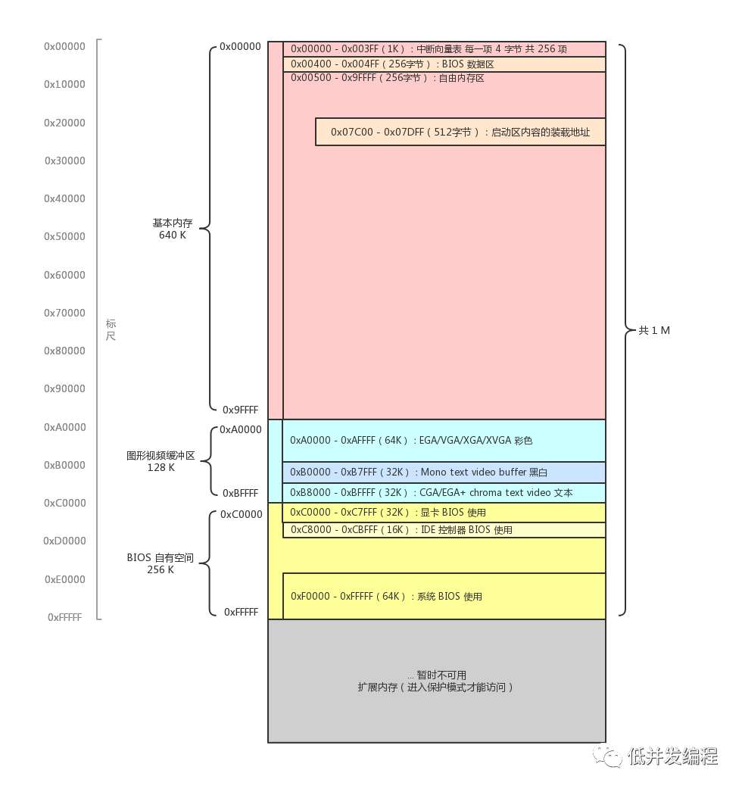

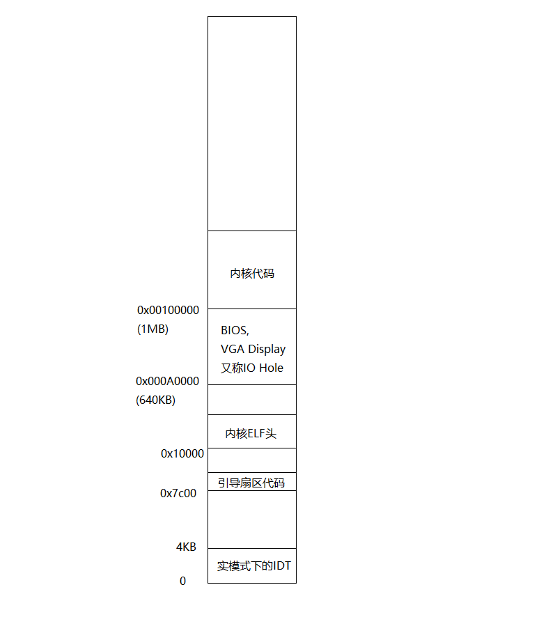

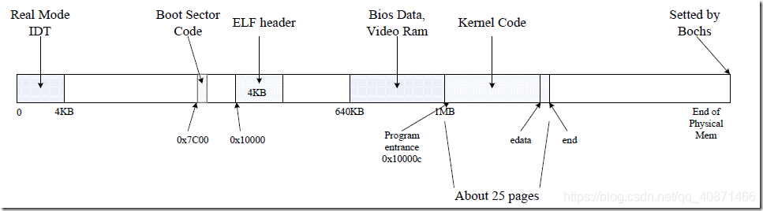

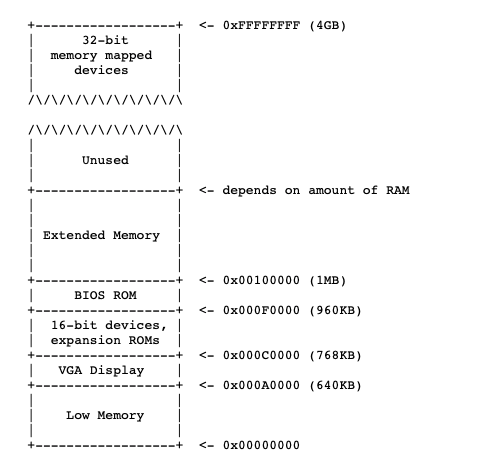

第一批PC基于16位英特尔8088处理器，只能寻址1MB的物理内存。因此，早期PC的物理地址空间将从0x00000000开始，但以0x000FFFFF而不是0xFFFFFFFF结束。标记为“低内存”的640 KB区域是早期PC所能使用的唯一随机访问内存(RAM)；事实上，最早的PC只能配置16 KB、32 KB或64 KB的RAM！

从0x000A0000到0x000FFFFF的384 KB区域是由硬件为特殊用途预留的，例如视频显示缓冲区和非易失性存储器中的固件。这个预留区最重要的部分是基本输入/输出系统(BIOS)，它从0x000F0000到0x000FFFFF占据了64 KB的区域。在早期的PC中，BIOS被保存在真正的只读存储器(ROM)中，而当前的PC则将BIOS存储在可更新的闪存中。BIOS负责执行基本的系统初始化，例如激活显卡和检查安装的内存量。执行此初始化后，BIOS将操作系统从软盘、硬盘、光盘或网络等适当位置加载，并将对机器的控制传递给操作系统。

当英特尔最终用80286和80386处理器“突破1MB的障碍”时，这两个处理器分别支持16 MB和4GB物理地址空间时，PC架构师仍然保留了低1MB物理地址空间的原始布局，以确保与现有软件的向后兼容性。因此，现代PC机在物理内存从0x000A0000到0x00100000之间有一个hole，将RAM划分为“低”或“常规内存”(最初的640 KB)和“扩展内存”(其他所有内容)。此外，PC 32位物理地址空间顶部的一些空间，尤其是物理RAM，现在通常由BIOS保留给32位PCI设备使用。

最近的x86处理器可以支持超过4GB的物理RAM，因此RAM可以扩展到0xFFFFFFFF之上。在这种情况下，BIOS必须安排在32位可寻址区域顶部的系统RAM中留下第二个hole，以便为这些32位设备的映射留出空间。由于设计上的限制，Jos将只使用PC物理内存的第一个256 MB，所以现在我们将假装所有PC“只有”一个32位物理地址空间。但是，处理复杂的物理地址空间和多年来演化而来的硬件组织的其他方面是OS开发的重要实际挑战之一。

---

## The ROM BIOS

通电后第一条指令为[f000:fff0] 0xffff0:	ljmp   $0xf000,$0xe05b

PC通电后会强制设置CS为0xf000，IP为0xfff0，也就是说第一条指令会在物理内存0xffff0处，该地址位于BIOS区域的尾部。

这是英特尔设计8088处理器的方式，IBM在他们最初的个人电脑中使用了这个处理器。由于PC中的BIOS是“硬连线”到物理地址范围0x000f0000-0x000fffff，此设计确保BIOS总是在开机或任何系统重新启动之后才能控制机器——这是至关重要的，因为在开机时，在机器的RAM中没有其他处理器可以执行的软件。

当BIOS运行时，它会初始化中断向量表，并初始化各种设备，比如VGA显示器。在初始化PCI总线和一些重要设备之后，它搜索可引导设备，如软盘，硬盘驱动器或CD-ROM。最终，当它找到一个可启动磁盘时时，BIOS从磁盘读取引导加载程序并将控制权传输给它。

# Part 2: The Boot Loader

用于PC的软盘和硬盘被划分为512个字节区域，称为扇区。扇区是磁盘的最小传输粒度：每个读或写操作必须是一个或多个扇区大小，并在扇区边界上对齐。如果磁盘是可引导的，则第一个扇区称为引导扇区，因为这是引导加载程序代码所在的位置。当BIOS找到可引导的软盘或硬盘时，它会将512字节的引导扇区加载到物理地址0x7c00到0x7dff的内存中，然后使用JMP指令将CS：IP设置为0000：7c00，并将控制权传递给引导加载程序。与BIOS加载地址一样，这些地址是相当任意的——但是它们对PC机来说是固定和标准化的。

在PC的发展过程中，从CD-ROM启动的技术很晚才出现，因此PC架构师利用这个机会稍微重新考虑了引导过程。因此，现代BIOS从CD-ROM引导的方式有点复杂(而且更强大)。CD-ROM使用的扇区大小为2048字节，而不是512字节，BIOS在将控制转移到内存(而不仅仅是一个扇区)之前，可以从磁盘加载更大的引导映像(而不仅仅是一个扇区)。

引导加载程序主要做以下几件事

1. 关闭中断，初始化寄存器
2. 开启A20，也就是处理器的第21根地址线。在早期8086处理器上每次到物理地址达到最高端的0xFFFFF时，再加1，就又会绕回到最低地址0x00000，当时很多程序员会利用这个特性编写代码，但是到了80286时代，处理器有了24根地址线，为了保证之前编写的程序还能运行在80286机子上。设计人员默认关闭了A20，需要我们自己打开，这样就解决了兼容性问题。
3. 加载全局描述符表，将处理器从实模式切换到32位保护模式，因为只有在这种模式下，软件才能访问处理器物理地址空间中1MB以上的所有内存。此时，您只需了解分段地址(段：偏移对)到物理地址的转换在受保护模式下是不同的，并且在转换偏移后是32位而不是16位。
4. 通过x86的特殊I/O指令直接访问IDE磁盘设备寄存器，从而从硬盘读取内核到内存。读取第一个扇区的SECTSIZE*8（一页）字节的内核文件（ELF格式）到物理内存ELFHDR（0x10000）处，其实第一个页就是操作系统映射文件到elf。读取完内核的elf文件，关于elf文件的解释首先会通过魔数来判断一下这个内核是否合理，再判断最后是否以0x55AA结尾。
5. 从加载的内核的入口进入，即把控制权转移给内核。

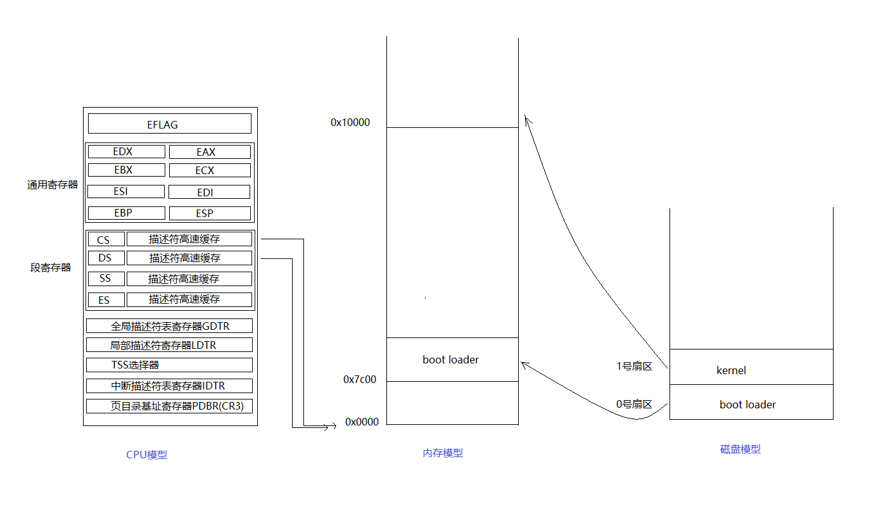

---

## 补充资料：实模式(real mode)与保护模式(protected mode)

可以参考文章
https://www.cnblogs.com/sssaltyfish/p/10656781.html

首先我们要知道这两种模式都是CPU的工作模式，实模式是早期CPU运行的工作模式，而保护模式则是现代CPU运行的模式。但是为什么现代CPU在运行boot loader时仍旧要先进入实模式呢？就是为了实现软件的向后兼容性不得已才这样的。

---

### 实模式(real mode)
实模式出现于早期8088CPU时期。当时由于CPU的性能有限，一共只有20位地址线（所以地址空间只有1MB），以及8个16位的通用寄存器，以及4个16位的段寄存器。所以为了能够通过这些16位的寄存器去构成20位的主存地址，必须采取一种特殊的方式。当某个指令想要访问某个内存地址时，它通常需要用这种格式来表示：(段基址：段偏移量)

其中第一个字段是段基址，它的值是由段寄存器提供的。段寄存器有4种，%cs，%ds，%ss，%es。具体这个指令采用哪个段寄存器是由这个指令的类型来决定的。比如要取指令就是采用%cs寄存器，要读取或写入数据就是%ds寄存器，如果要对堆栈操作就是%ss寄存器。总之，不管什么指令，都会有一个段寄存器提供一个16位的段基址。

第二字段是段内偏移量，代表你要访问的这个内存地址距离这个段基址的偏移。它的值就是由通用寄存器来提供的，所以也是16位。那么问题来了，两个16位的值如何组合成一个20位的地址呢？这里采用的方式是把段寄存器所提供的段基址先向左移4位。这样就变成了一个20位的值，然后再与段偏移量相加。所以算法为：物理地址 = 段基址<<4 + 段内偏移

所以假设 %cs中的值是0xff00，%ax = 0x0110。则(%cs:%ax)这个地址对应的真实物理地址是 0xff00<<4 + 0x0110 = 0xff110。

上面就是实模式访问内存地址的原理。

---

### 保护模式(protected mode)
但是随着CPU的发展，CPU的地址线的个数也从原来的20根变为现在的32根，所以可以访问的内存空间也从1MB变为现在4GB，寄存器的位数也变为32位。所以实模式下的内存地址计算方式就已经不再适合了。所以就引入了现在的保护模式，实现更大空间的，更灵活的内存访问。

在介绍保护模式的工作原理之前，我们必须先清楚以下几个容易混淆的概念。逻辑地址(logical address)，虚拟地址(virtual address)，线性地址(linear address)，物理地址(physical address)。

我们都知道，如今在编写程序时，程序时运行在虚拟地址空间下的，也就是说，在程序员编写程序时指令中出现的地址并不一定时这个程序在内存中运行时真正要访问的内存地址。这样做的目的就是为了能够让程序员在编程时不需要直接操作真实地址，因为当它在真实运行时，内存中各个程序的分布情况是不可能在你编写程序时就知道的。所以这个程序的这条指令到底要访问哪个内存单元是由操作系统来确定的。所以这就是一个从虚拟地址(virtual address)到真实主存中的物理地址(physical address)的转换。

那么逻辑地址(logical address)又是什么呢？根据上面一段文字我们知道，程序员编写时看到的是虚拟地址，但是并不是说程序员是直接把这个虚拟地址写到指令中的。它是由逻辑地址推导得到的。所以指令中真实出现的是逻辑地址。一个逻辑地址是由两部分组成的，一个段选择子(segment selector)，一个段内偏移量(offset)，通常被写作segment:offset。而且采用哪个段选择子通常也是在指令中隐含的，程序员通常只需要指明段内偏移量。然后分段管理机构(segmentation hardware)将会把这个逻辑地址转换为线性地址(linear address)。如果该机器没有采用分页机制(paging hardware)的话，此时linear address就是最后的主存物理地址。但是如果机器中还有分页设备的话，比如内存大小实际只有1G，但是根据前面我们知道可访问的空间有4G。所以此时还需要分页机构(paging hardware)把这个线性地址转换为最终的真实物理地址。所以可见虚拟地址和线性地址的含义是差不多的。我们可以再下图中看到我们上面叙述的地址转换过程。在boot loader中，并没有开启分页机构。所以计算出来的线性地址就是真实要访问的主存地址。

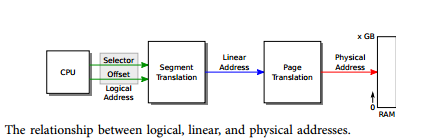

那么在保护模式下，我们是如何通过segment:offset最终得到物理地址的呢？

首先，在计算机中存在两个表，GDT，LDT。它们两个其实是同类型的表，前者叫做全局段描述符表，后者叫做本地段描述符表。他们都是用来存放关于某个运行在内存中的程序的分段信息的。比如某个程序的代码段是从哪里开始，有多大；数据段又是从哪里开始，有多大。GDT表是全局可见的，也就是说每一个运行在内存中的程序都能看到这个表。所以操作系统内核程序的段信息就存在这里面。还有一个LDT表，这个表是每一个在内存中的程序都包含的，里面指明了每一个程序的段信息。我们可以看一下这两个表的结构，如下图所示：

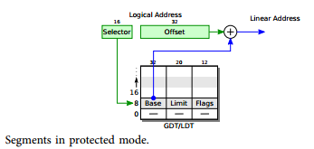

我们从图中可以看到，无论是GDT，还是LDT。每一个表项都包括三个字段：

Base : 32位，代表这个程序的这个段的基地址。

Limit : 20位，代表这个程序的这个段的大小。

Flags ：12位，代表这个程序的这个段的访问权限。

当程序中给出逻辑地址 segment:offset时，他并不是像实模式那样，用segment的值作为段基址。而是把这个segment的值作为一个selector，代表这个段的段表项在GDT/LDT表的索引。比如你当前要访问的地址是segment:offset = 0x01:0x0000ffff，此时由于每个段表项的长度为8，所以此时应该取出地址8处的段表项。然后首先根据Flags字段来判断是否可以访问这个段的内容，这样做是为了能够实现进程间地址的保护。如果能访问，则把Base字段的内容取出，直接与offset相加，就得到线性地址(linear address)了。之后就是要根据是否有分页机构来进行地址转换了。

比如当前Base字段的值是0x00f0000，则最后线性地址的值为0x00f0ffff。

如上所述就是保护模式下，内存地址的计算方法。

---

综述，通过上面的叙述可见，保护模式还是要比实模式的工作方式灵活许多，可以在以下几个方面看出来：

1. 实模式下段基地址必须是16的整数倍，保护模式下段基地址可以是4GB空间内的任意一个地址。

2. 实模式下段的长度是65536B，但是保护模式下段的长度也是可以达到4GB的。

3. 保护模式下可以对内存的访问多加一层保护，但是实模式没有。

# Part 3: The Kernel

操作系统内核通常喜欢在非常高的虚拟地址(如0xf0100000)中链接和运行，以便将处理器虚拟地址空间的较低部分留给用户程序使用。

许多机器在地址0xf0100000上没有任何物理内存，因此我们不能指望能够将内核存储在那里。解决方案就是在虚拟地址空间中，我们还是把操作系统放在高地址处0xf0100000，但是在实际的内存中我们把操作系统存放在一个低的物理地址空间处，如0x00100000。那么当用户程序想访问一个操作系统内核的指令时，首先给出的是一个高的虚拟地址，然后计算机中通过某个机构把这个虚拟地址映射为真实的物理地址，这样就解决了上述的问题。那么这种机构通常是通过分段管理，分页管理来实现的。

---

## Paging

虚拟地址的高10位（0000000010B）作为页目录的下标，从页目录中获取页表的物理地址0x08001000，虚拟地址的第11~20位（0000000001B）作为页表的下标，得到该页对应的物理地址0x0000c000，最后将虚拟地址的低12位（000001010000B或者0x50）和得到的页的物理地址（0x0000c000）加得到0x00000c050就是虚拟地址0x00801050转换后的物理地址。

---

## The Stack

栈的生长顺序为由高到低

X86堆栈指针(esp寄存器)指向当前正在使用的堆栈上的最低位置。在这个地址之下的更低的地址空间都是还没有被利用的堆栈空间。在32位模式下，堆栈只能容纳32位值，esp总是可以被4整除。各种x86指令，如Call，都是“硬连线”来使用堆栈指针寄存器的.

相反，ebp(基址指针)寄存器主要通过软件约定与堆栈相关联。在输入C函数时，函数的prologue代码通常通过将前一个函数的基址指针推到堆栈上来保存它，然后在函数的持续时间内将当前的esp值复制到ebp中。如果程序中的所有函数都遵守这一约定，那么在程序执行过程中的任何给定点上，都可以通过跟踪保存的ebp指针链并确定函数调用的嵌套顺序来追溯堆栈，从而达到程序中的这个特定点。这个功能可能特别有用，例如，当某个特定的函数由于传递了错误的参数而导致assert失败或panic时，但是您不确定是谁传递了坏参数。堆栈回溯可以让您找到违规的函数。这个寄存器的值代表该子程序的栈帧的最高地址。

eip则指的是这个子程序执行完成之后要返回调用它的子程序时，下一个要执行的指令地址。

函数调用过程为

1. 执行call指令前，函数调用者将参数入栈，按照函数列表从右到左的顺序入栈（如果参数为一个地址，那么我们应该压入该参数的起始地址）（比如：压入一个int值，在压入寄存器sp值，那么实际上就相当于函数的一个int指针）
2. call指令会自动将将调用函数的下一个指令地址eip作为返回地址入栈，而ret指令将自动从栈中弹出该值到eip寄存器
3. 被调用函数负责：将ebp入栈，esp的值赋给ebp。所以反汇编一个函数会发现开头两个指令都是push %ebp, mov %esp,%ebp。
4. 按声明的顺序将被调用函数的局部变量入栈
5. 将被调用函数的第一条指令地址赋值给eip寄存器
6. 开始执行被调用函数的指令

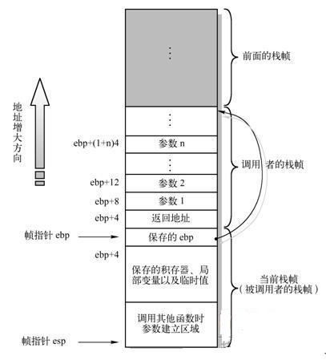

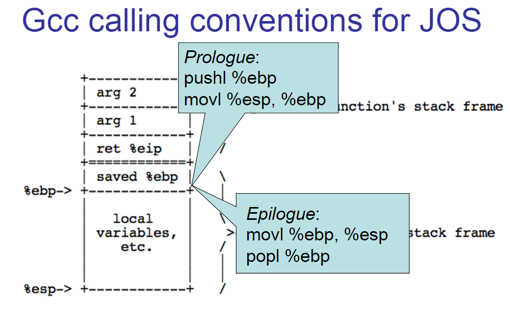

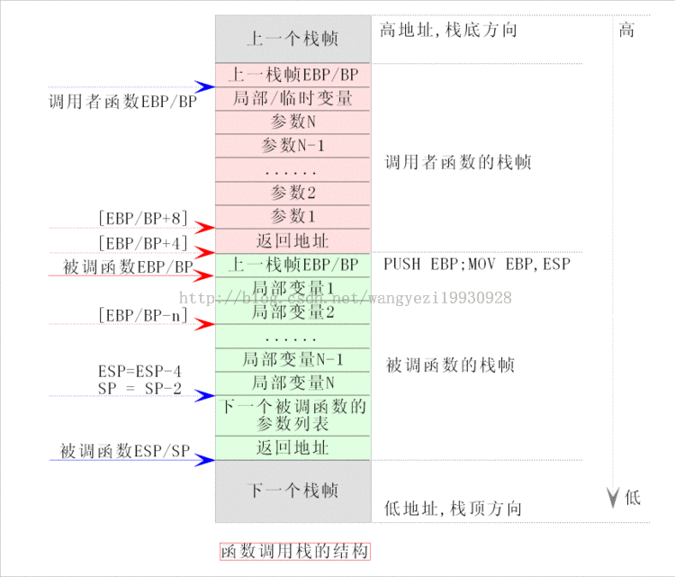

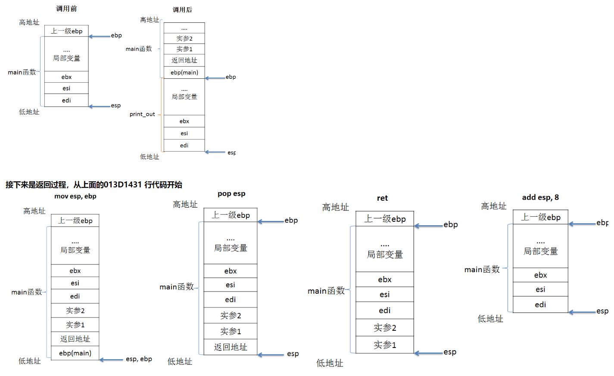

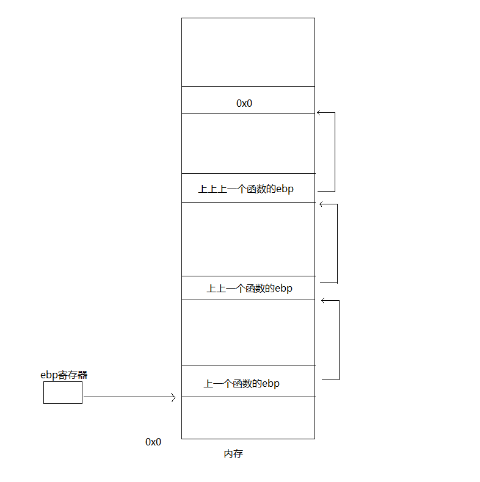

我们由此可以很轻松的获取我们想要的参数：
1. 返回地址= ebp + 4
2. 参数n = ebp + 4*( n + 1 )。
3. 调用函数（上一个函数）的ebp地址为*ebp
