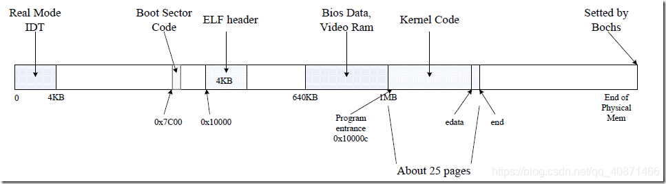
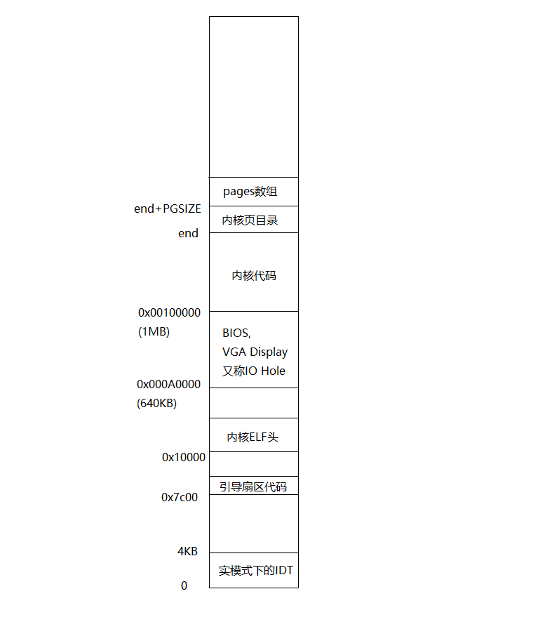
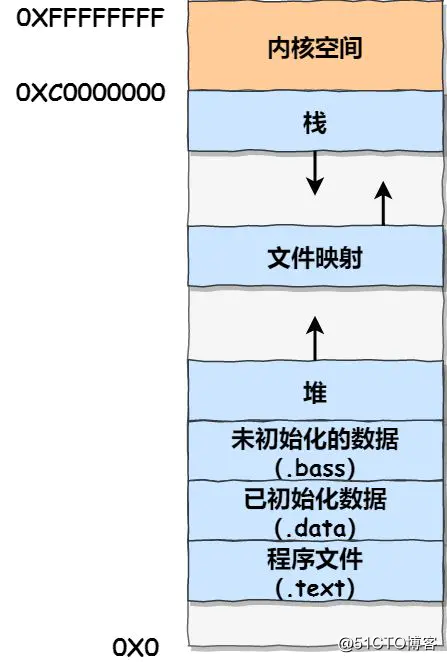
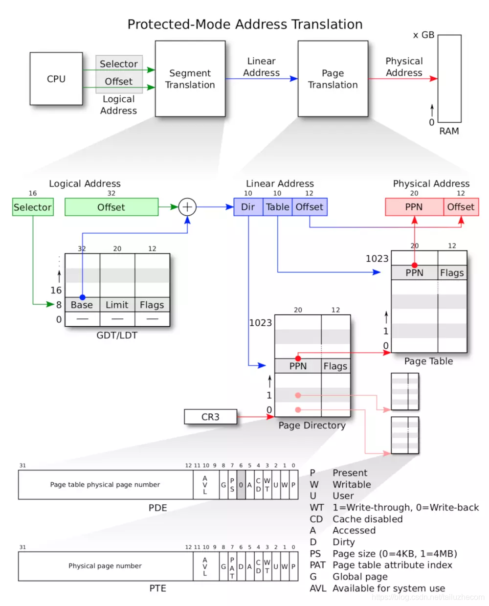
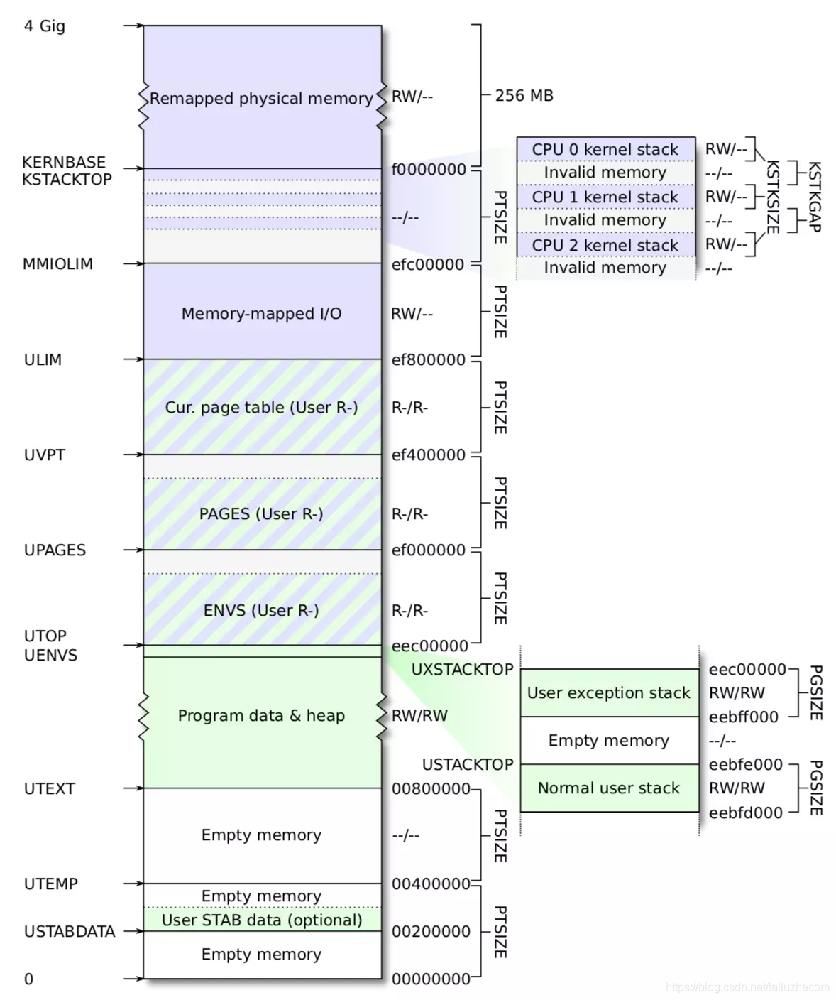
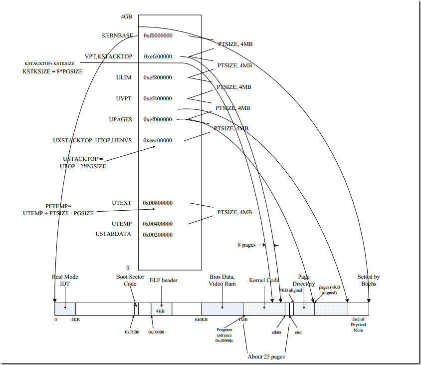
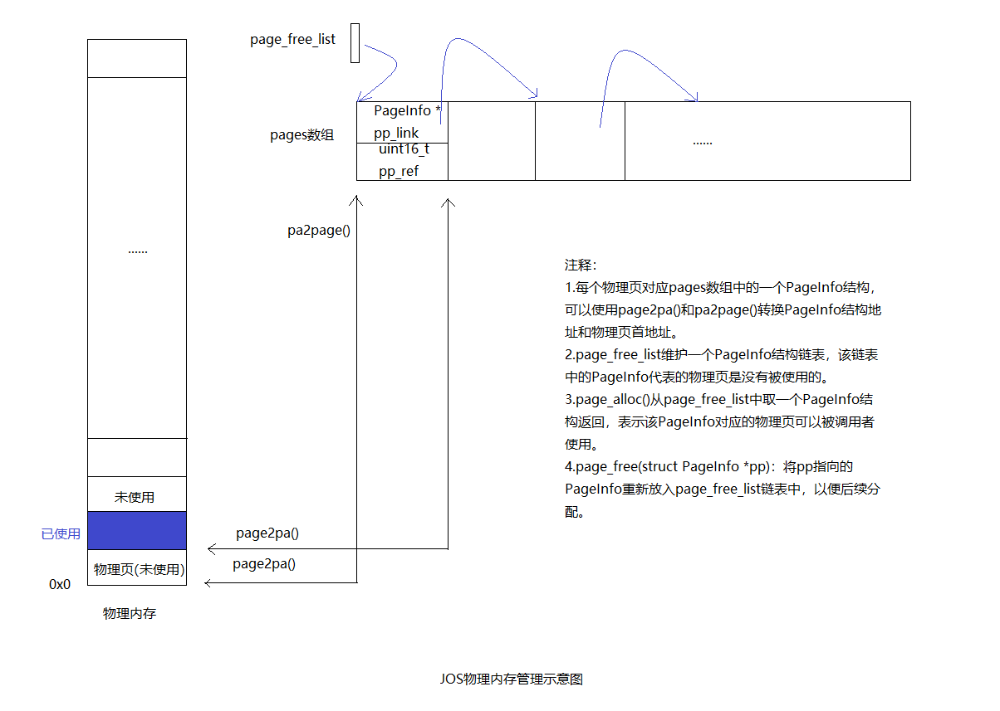
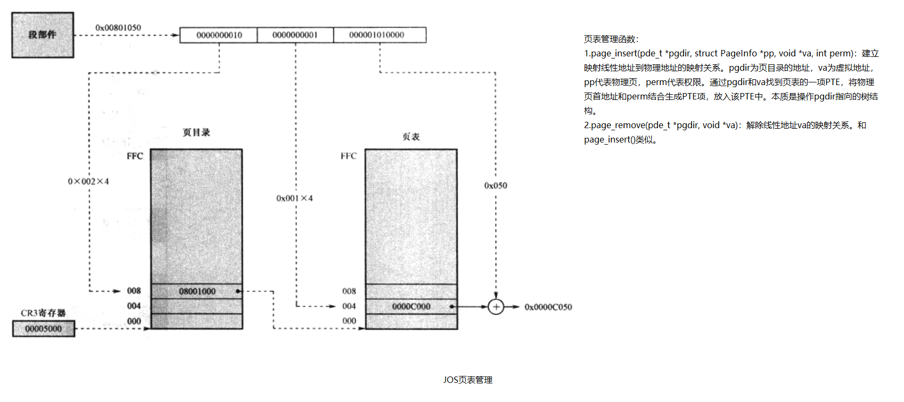
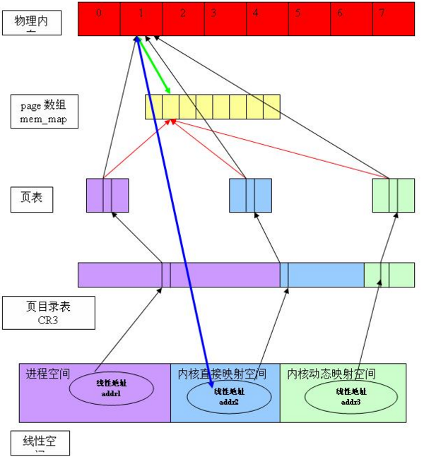

# Part 1: Physical Page Management

你将编写一个内存管理代码。主要分为两大部分。分别对物理内存和虚拟内存的管理。

对于物理内存，每次分配内存分配器会为你分配4096bytes。也称为一个页（在大部分操作系统中一个页的大小都是4B）你需要维护一个数据结构来记录哪个物理页是空闲的哪个物理页是已被占用的。以及有多少进程共享已分配的页。并且你需要编写程序来进行内存的分配和回收。

对于虚拟内存，它将内核和用户软件使用的虚拟地址映射到物理内存中的地址。 x86硬件的内存管理单元（MMU）在指令使用内存时执行映射，查阅一组页表。

物理内存大致上可以分为三部分：
1. 0x00000~0xA0000：这部分叫做basemem，是可用的（除了前4kb的IDT）
2. 接着是0xA0000~0x100000：这部分叫做IO Hole，不可用，主要被用来分配给外部设备。
3. 再接着就是0x100000以上的部分：这部分叫做extmem，可用，是最重要的内存区域。

物理内存每一块可以分为五部分：
1. bss段（bss segment）：bss是Block Started by Symbol的简称，用来存放程序中未初始化的全局变量的内存区域，属于静态内存分配。
2. data段（data segment）：用来存放程序中已初始化的全局变量的内存区域，属于静态内存分配。
3. text段（text segment）：用来存放程序执行代码的内存区域。这部分区域的大小在程序运行前就已经确定，并且内存区域通常属于只读（某些架构也允许代码段为可写，即允许修改程序）。也有可能包含一些只读的常数变量，例如字符串常量等。
4. 堆（heap）：用于存放进程运行中被动态分配的内存段，它的大小并不固定，可动态扩张或缩减。
5. 栈（stack）：用户存放程序临时创建的局部变量，也就是说我们函数括弧“{}”中定义的变量（但不包括static声明的变量，static意味着在data段中存放变量）。除此以外，在函数被调用时，其参数也会被压入发起调用的进程栈中，并且待到调用结束后，函数的返回值也会被存放回栈中。

通过硬件支持，我们可以找到内核bss段结尾位置end（end更高地址为堆的区域），然后申请内存将[end,end+PGSIZE]的空间开辟为内核页目录表，然后申请内存将[end+PGSIZE,end+PGSIZE+npages]的空间开辟为内核页表数组（npages是页表数目），再用链表连接每一个空闲页表，之后就可以封装malloc等函数来使用堆里面的空闲空间了。

    假设PGSIZE=4kB。
    页表结构struct PageInfo的大小为8字节，所以相当于8字节结构对应到了物理内存和虚拟内存的4kB。
    假设页表结构数组的起始地址为pages
    第k个页表       第k个页表结构物理地址           页表对应物理地址        
    0               [pages,pages+8]                 [0,PGSIZE]              
    1               [pages+8,pages+2*8]             [PGSIZE,2*PGSIZE]       
    2               [pages+2*8,pages+3*8]           [2*PGSIZE,3*PGSIZE]     
    k               [pages+k*8,pages+(k+1)*8]       [k*PGSIZE,(k+1)*PGSIZE] 

# Part 2: Virtual Memory

1. P —— Present，判断对应物理页面是否存在，存在为1，否则为0;
2. W —— Write，该位用来判断对所指向的物理页面是否可写，1可写，0不可写；
3. U —— User，该位用来定义页面的访问者应该具备的权限。为1是User权限即可，如果为 0，表示需要高特权级才能访问；
4. WT —— 1=Write-through，0=Write-back；对应物理页面在写入时是否写透(即向更低级储存设备写入)。
5. CD —— Cache Disabled，1为禁用缓存，0不禁用；对应物理页面是否能被放入高速缓存。
6. A —— Accessed，最近是否被访问;
7. D —— Dirty，是否被修改;
8. AVL —— Available，可以被系统程序所使用;
9. 0 —— 保留位

这张图大概就帮我们复习了一下物理内存和虚拟内存的转换：

我们代码中的 C 指针就是虚拟地址（Virtual Address）中的 offset，为了简便，在boot/boot.S文件中，我们引入了一个全局描述符表，这个表通过把所有段的基址设置为0，界限设置为0xffffffff的方式，关闭了分段管理的功能。因此虚拟地址中的段选择子字段的内容已经没有任何意义，线性地址的值总是等于虚拟地址中段内偏移的值。 在未开启分页之前，线性地址就是物理地址。而在我们开启分页之后，线性地址经过 CPU 的MMU部件的页式转换得到物理地址。

开启分页后，当处理器碰到一个线性地址后，它的MMU部件会把这个地址分成 3 部分，分别是页目录索引(Directory)、页表索引(Table)和页内偏移(Offset)， 这 3 个部分把原本 32 位的线性地址分成了 10+10+12 的 3 个片段。每个页表的大小为4KB（因为页内偏移为12位）。

举例：现在要将线性地址 0xf011294c 转换成物理地址。首先取高 10 位(页目录项偏移)即960(0x3c0)，中间 10 位(页表项偏移)为274(0x112)，偏移地址为1942(0x796)。
首先，处理器通过CR3寄存器找到PAGE_DIR所在的位置，并取得其中的第 960 项页目
录项，取得该页目录项的高 20 位地址，从而得到对应的页表物理页的首地址，再次取得页表中的第274项页表项，并进而取得该页表项的首地址，加上线性地址的低12位偏移地址1942，从而得到物理地址。

由上面也可知道，每个页目录表有1024个页目录项，每个页目录项占用4字节，一个页目录表占4KB内存。而每个页目录项都指向一个有1024个页表项的页表，每个页表项也占用4字节，因此JOS中页目录和页表一共要占用 1025 * 4KB = 4100KB 约4MB的内存。而通常我们说每个用户进程虚拟地址空间为4GB，其实就是每个进程都有一个页目录表，进程运行时将页目录地址装载到CR3寄存器中，从而每个进程最大可以用4GB内存。在JOS中，为了简单起见，只用了一个页目录表，整个系统的线性地址空间4GB是被内核和所有其他的用户程序所共用的。

分页管理中，页目录以及页表都存放在内存中，而由于CPU 和内存速度的不匹配，这样地址翻译时势必会降低系统的效率。为了提高地址翻译的速度，x86处理器引入了地址翻译缓存TLB（旁路转换缓冲）来缓存最近翻译过的地址。当然缓存之后会引入缓存和内存中页表内容不一致的问题，可以通过重载CR3使整个TLB内容失效或者通过 invlpg 指令。

我们只能解引用虚拟地址，不能解引用物理地址。

# Part 3: Kernel Address Space

以下是虚拟内存布局（出现的地址是虚拟地址）：
    
    Virtual memory map:                             Permissions
                                                    kernel/user
    4 Gig -------->  +------------------------------+
                     |                              | RW/--
                     ~~~~~~~~~~~~~~~~~~~~~~~~~~~~~~~~
                     :              .               :
                     :              .               :
                     :              .               :
                     |~~~~~~~~~~~~~~~~~~~~~~~~~~~~~~| RW/--
                     |                              | RW/--
                     |   Remapped Physical Memory   | RW/--
                     |                              | RW/--
    KERNBASE, ---->  +------------------------------+ 0xf0000000      --+
    KSTACKTOP        |     CPU0's Kernel Stack      | RW/--  KSTKSIZE   |
                     | - - - - - - - - - - - - - - -|                   |
                     |      Invalid Memory (*)      | --/--  KSTKGAP    |
                     +------------------------------+                   |
                     |     CPU1's Kernel Stack      | RW/--  KSTKSIZE   |
                     | - - - - - - - - - - - - - - -|                 PTSIZE
                     |      Invalid Memory (*)      | --/--  KSTKGAP    |
                     :              .               :                   |
                     :              .               :                   |
    MMIOLIM ------>  +------------------------------+ 0xefc00000      --+
                     |       Memory-mapped I/O      | RW/--  PTSIZE
    ULIM,MMIOBASE->  +------------------------------+ 0xef800000
                     |  Cur. Page Table (User R-)   | R-/R-  PTSIZE
    UVPT      ---->  +------------------------------+ 0xef400000
                     |          RO PAGES            | R-/R-  PTSIZE
    UPAGES    ---->  +------------------------------+ 0xef000000
                     |           RO ENVS            | R-/R-  PTSIZE
    UTOP,UENVS---->  +------------------------------+ 0xeec00000
    UXSTACKTOP -/    |     User Exception Stack     | RW/RW  PGSIZE
                     +------------------------------+ 0xeebff000
                     |       Empty Memory (*)       | --/--  PGSIZE
    USTACKTOP  --->  +------------------------------+ 0xeebfe000
                     |      Normal User Stack       | RW/RW  PGSIZE
                     +------------------------------+ 0xeebfd000
                     |                              |
                     |                              |
                     ~~~~~~~~~~~~~~~~~~~~~~~~~~~~~~~~
                     .                              .
                     .                              .
                     .                              .
                     |~~~~~~~~~~~~~~~~~~~~~~~~~~~~~~|
                     |     Program Data & Heap      |
    UTEXT -------->  +------------------------------+ 0x00800000
    PFTEMP ------->  |       Empty Memory (*)       |        PTSIZE
                     |                              |
    UTEMP -------->  +------------------------------+ 0x00400000      --+
                     |       Empty Memory (*)       |                   |
                     | - - - - - - - - - - - - - - -|                   |
                     |  User STAB Data (optional)   |                 PTSIZE
    USTABDATA ---->  +------------------------------+ 0x00200000        |
                     |       Empty Memory (*)       |                   |
    0 ------------>  +------------------------------+                 --+

    Note: The kernel ensures that "Invalid Memory" is *never* mapped.
    "Empty Memory" is normally unmapped, but user programs may map pages
    there if desired.  JOS user programs map pages temporarily at UTEMP.

虚拟内存UPAGES或者说PAGES数组存储的是512个8字节的struct PageInfo，空闲内存链表的节点就是struct PageInfo。

    假设内核bss段结尾的物理内存地址是end
    假设PGSIZE=0x00400000

    virtual address                         physical address
    [0xf0000000,0xffffffff]                 [0x00000000,0x0fffffff]
    KSTACK[0xefc00000,0xf0000000]           bootstack//内核栈
    [UVPT,ULIM][0xef400000,0xef800000]      [end+PGSIZE,end+2*PGSIZE]//内核页目录
    [UPAGES,UVPT][0xef000000,0xef400000]    pages[end,end+PGSIZE]//结构PageInfo也是页表

注意：页表存储的都是物理地址！！

注意：虚拟地址[KERNBASE, 2^32)被映射到物理地址[0, 2^32 - KERNBASE)。0xf018f000为页目录kern_pgdir的虚拟地址起始处，被映射到了物理地址0x0018f000，0xf0190000为页表pages数组的虚拟地址起始处，被映射到了物理地址0x00190000。它们还将页目录虚拟地址起始处UVPT即0xef400000映射到了物理地址0x0018f000，将页表虚拟地址起始处UPAGES即0xef000000映射到了物理地址0x00190000。由此可见，虚拟内存到物理内存的关系是多对一的。(注意，有映射关系不代表就会分配和占用内存)

注意：即使我们可能没有( 2^32 - KERNBASE )字节的物理地址，但是也可以直接映射。

# 总结
该实验大体上做三件事：

提供管理物理内存的数据结构和函数，可总结为下图：

提供修改页目录和页表树结构的函数，从而达到虚拟页到物理页映射的目的。可总结为下图：

用前面两部分的函数建立内核的线性地址空间。内核的线性地址空间到物理内存的映射可总结为下图：

现在我们可以直接使用UPAGES这个虚拟地址直接访问pages数组，使用UVPT访问内核页目录表，使用KSTACKTOP访问内核栈。

# 拓展

上图是实际操作系统的情况，反映了如下信息：
1. 进程的4G 线性空间被划分成三个部分：进程空间（0-3G）、内核直接映射空间（3G – high_memory）、内核动态映射空间（VMALLOC_START - VMALLOC_END）

2. 三个空间使用同一张页目录表，通过 CR3 可找到此页目录表。但不同的空间在页目录表中页对应不同的项，因此互相不冲突

3. 内核初始化以后，根据实际物理内存的大小，计算出 high_memory、VMALLOC_START、VMALLOC_END 的值。并为“内核直接映射”空间建立好映射关系，所有的物理内存都可以通过此空间进行访问。

4. “进程空间”和“内核动态映射空间”的映射关系是动态建立的（通过缺页异常）

假设有三个线性地址 addr1, addr2, addr3 ，分别属于三个线性空间不同部分（0-3G、3G-high_memory、vmalloc_start-vmalloc_end），但是最终都映射到物理页面1：

1. 三个地址对应不同的页表和页表项

2. 但是页表项的高 20bit 肯定是1，表示物理页面的索引号是1

3. 同时，根据高 20 bit，可以从 mem_map[] 中找到对应的 struct page 结构，struct page 用于管理实际的物理页面（就是实际物理页面的物理地址了，到这里就不绕弯子了，顺便想到高速缓冲的匹配命中操作是用哈希表，换算出的要访问的实际物理地址拿到哈希表的输入计算一下哈希值，看看有没命中）（红线）

4. 从线性地址，根据页目录表，页表，可以找到物理地址

5. Struct page 和物理地址之间很容易互相转换

6. 从物理地址，可以很容易的反推出在内核直接映射空间的线性地址（蓝线）。要想得到在进程空间或者内核动态映射空间的对应的线性地址，则需要遍历相应的“虚存区间”链表。

关于页目录表：

1、 每个进程有一个属于自己的页目录表，可通过 CR3 寄存器找到

2、 而内核也有一个独立于其它进程的页目录表，保存在 swapper_pg_dir[] 数组中

3、 当进程切换的时候，只需要将新进程的页目录把地址加载到 CR3 寄存器中即可

4、 创建一个新进程的时候，需要为它分配一个 page，作为页目录表，并将 swapper_pg_dir[] 的高 256 项拷贝过来，低 768 项则清0

linux0.11版本，所有进程共享同一个页目录而各自使用不同的页表，该共享的页目录就放在物理地址最前面的4k

---

## LINUX的分段策略

Linux在X86上采用最低限度的分段机制，其目的是为了避开复杂的分段机制，提高Linux在其他不支持分段机制的硬件平台的可移植性，同时又充分利用X86的分段机制来隔离用户代码和内核代码。因此，在Linux上，逻辑地址和线性地址具有相同的值。

由于X86的GDT最大表长为64KB，每个段描述符为8B，所以GDT最多能够容纳8192个段描述符。每产生一个进程，Linux为该进程在GDT中创建两个描述符：LDT段描述符和TSS描述符，除去Linux在GDT中保留的前12项，GDT实际最多能容纳4090个进程。Linux的内核自身有独立的代码段和数据段，其对应的段描述符分别存储在GDT中的第2项和第3项。每个进程也有独立的代码段和数据段，对应的段描述符存储在它自己的LDT中。

在Linux中，每个用户进程都可以访问4GB的线性地址空间。其中0x0~0xBFFFFFFF的3GB空间为用户态空间，用户态进程可以直接访问。从0xC0000000~0x3FFFFFFF的1GB空间为内核态空间，存放内核访问的代码和数据，用户态进程不能直接访问。当用户进程通过中断或系统调用访问内核态空间时，会触发X86的特权级转换（从特权级3切换到特权级0），即从用户态切换到内核态。

### LINUX的分页策略

标准Linux的分页是三级页表结构，除了X86支持的页目录和页，还有一级被称为中间页目录。因此，线性地址在转换为物理地址的过程中，线性地址就被解释为四个部分（不是X86所认识的三个部分），增加了页中间目录中的索引。当运行在X86平台上时，Linux通过将中间页目录最大的页目录项个数定义为1，并提供一组相关的宏（这些宏将中间页目录用页目录来替换）将三级页面结构分解过程完美的转换为X86使用的二级页面分解。这样，无需改动内核中页面解释的主要代码（这些代码都是认为线性地址由四个部分组成）。关于这些宏定义参见Linux源码"/include/asm/pgtable.h"，"/include/asm/page.h"。

内核态虚拟空间从3GB到3GB+4MB的一段（对应进程页目录第768项指引的页表），被映射到物理地址0x0~0x3FFFFF（4MB）。因此，进程处于内核态时，只要通过访问3GB到3GB+4MB就可访问物理内存的低4MB空间。所有进程从3GB到4GB的线性空间都是一样的，由同样的页目录项，同样的页表，映射到相同的物理内存段。Linux以这种方式让内核态进程共享代码和数据。
