# Introduction
本文主要介绍JOS中的进程，异常处理，系统调用。内容上分为三部分：

1. 用户环境建立，可以加载用户ELF文件并执行。（目前还没有文件系统，需要在内核代码硬编码需要加载的用户程序）
2. 建立异常处理机制，异常发生时能从用户态进入内核态进行处理，然后返回用户态。
3. 借助异常处理机制，提供系统调用的能力。

注意：本实验指的用户环境和UNIX中的进程是一个概念！！！！！！！之所有没有使用进程是强调JOS的用户环境和UNIX进程将提供不同的接口。

# Part A: User Environments

    typedef int32_t envid_t; //用户环境ID变量，32位的。

    An environment ID 'envid_t' has three parts:

    +1+---------------21-----------------+--------10--------+
    |0|          Uniqueifier             |   Environment    |
    | |                                  |      Index       |
    +------------------------------------+------------------+
                                          \--- ENVX(eid) --/

    The environment index ENVX(eid) equals the environment's index in the
    'envs[]' array.  The uniqueifier distinguishes environments that were
    created at different times, but share the same environment index.

    All real environments are greater than 0 (so the sign bit is zero).
    envid_ts less than 0 signify errors.  The envid_t == 0 is special, and
    stands for the current environment.

    struct Env {
	    struct Trapframe env_tf;	// Saved registers
	    struct Env *env_link;		// Next free Env
	    envid_t env_id;			// Unique environment identifier
	    envid_t env_parent_id;		// env_id of this env's parent
	    enum EnvType env_type;		// Indicates special system environments
	    unsigned env_status;		// Status of the environment
	    uint32_t env_runs;		// Number of times environment has run

	    // Address space
	    pde_t *env_pgdir;		// Kernel virtual address of page dir
    };
    各个字段解释如下：
    env_tf：Trapframe结构定义在inc/trap.h中，相当于寄存器的一个快照，当前用户环境重新运行时，该结构中保存的寄存器信息将被重新载入到寄存器运行。
    env_link：指向下一个ENV结构，用于构建链表使用。
    env_id：用户环境的id
    env_parent_id：当前用户环境父节点的id
    env_type：对于大部分用户环境是ENV_TYPE_USER，后面将会介绍特殊的系统服务环境
    env_status：当前用户环境状态
    env_pgdir：页目录地址

就像Unix中的进程一样，一个JOS环境中结合了“线程”和“地址空间”的概念。线程通常是由被保存的寄存器的值来定义的，而地址空间则是由env_pgdir所指向的页目录表还有页表来定义的。为了运行一个用户环境，内核必须设置合适的寄存器的值以及合适的地址空间。

我们的struct Env类似于xv 6中的struct proc。这两种结构都在TrapFrame结构中保存环境的(即进程的)用户模式寄存器的状态。在Jos中，单个环境不像xv 6中的进程那样有自己的内核堆栈。一次只能在内核中激活一个Jos环境，因此Jos只需要一个内核堆栈。

注意的实现细节：每次生成的env_id的第11至第31位（即Uniqueifier）都比上次多1，由此可以区分所有不同的共享某块物理内存的所有进程，实现细节如下

    // Generate an env_id for this environment.
    generation = (e->env_id + (1 << ENVGENSHIFT)) & ~(NENV - 1);
    if (generation <= 0)    // Don't create a negative env_id.
        generation = 1 << ENVGENSHIFT;
    e->env_id = generation | (e - envs);
    
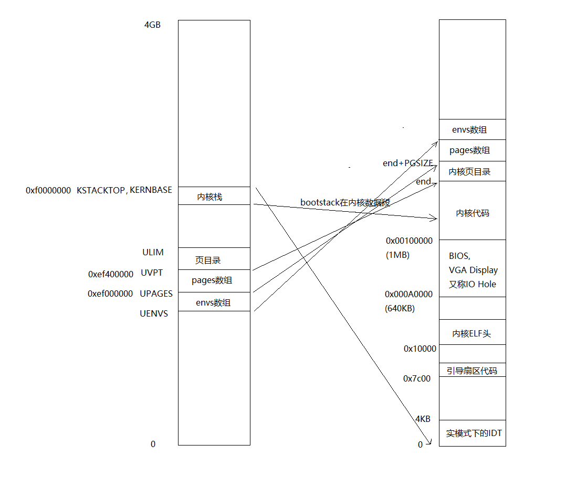

---

## Creating and Running Environments

本节需要实现env相关函数，以下是实现过程的一些要用到的知识。

---

## GDT&&LDT
现在您将用Kern/env.c编写运行用户环境所必需的代码。因为我们还没有文件系统，所以我们将设置内核来加载嵌入在内核中的静态二进制镜像文件。Jos将此二进制文件作为ELF可执行镜像文件嵌入内核中。

首先，再补充一些关于GDT和LDT的知识

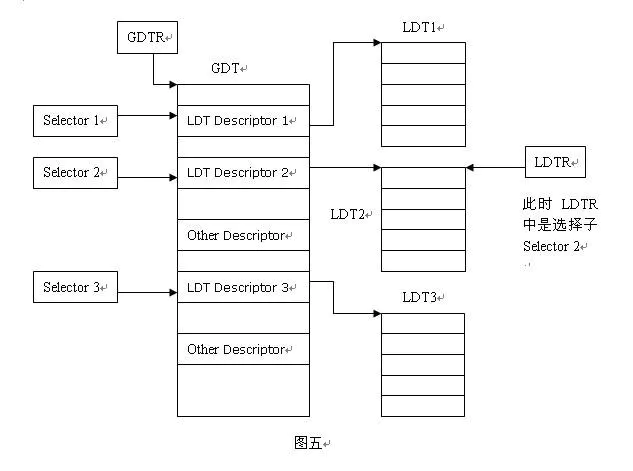

LDT和GDT从本质上说是相同的，只是LDT嵌套在GDT之中。LDTR记录局部描述符表的起始位置，与GDTR不同LDTR的内容是一个段选择子。由于LDT本身同样是一段内存，也是一个段，所以它也有个描述符描述它，这个描述符就存储在GDT中，对应这个表述符也会有一个选择子，LDTR装载的就是这样一个选择子。LDTR可以在程序中随时改变，通过使用lldt指令。如上图，如果装载的是Selector 2则LDTR指向的是表LDT2。

其实只要知道LDT就是GDT中的一些段。然后我们有LDTR来指向LDT的起始地址，所以LDTR里面装的是段选择子

下面具体分析一下GDT，它具体的结构如下

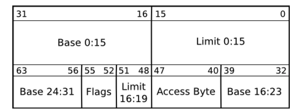

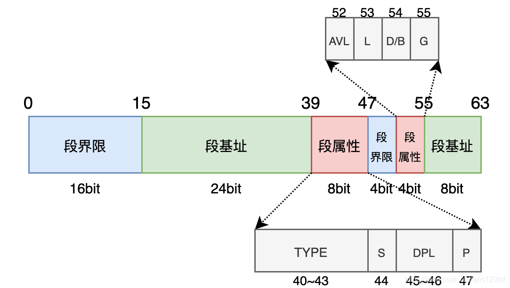

在代码中表现形式如下

    // Segment Descriptors
    struct Segdesc {
	    unsigned sd_lim_15_0 : 16;  // Low bits of segment limit
	    unsigned sd_base_15_0 : 16; // Low bits of segment base address
	    unsigned sd_base_23_16 : 8; // Middle bits of segment base address
	    unsigned sd_type : 4;       // Segment type (see STS_ constants)
	    unsigned sd_s : 1;          // 0 = system, 1 = application
	    unsigned sd_dpl : 2;        // Descriptor Privilege Level
	    unsigned sd_p : 1;          // Present
	    unsigned sd_lim_19_16 : 4;  // High bits of segment limit
	    unsigned sd_avl : 1;        // Unused (available for software use)
	    unsigned sd_rsv1 : 1;       // Reserved
	    unsigned sd_db : 1;         // 0 = 16-bit segment, 1 = 32-bit segment
	    unsigned sd_g : 1;          // Granularity: limit scaled by 4K when set
	    unsigned sd_base_31_24 : 8; // High bits of segment base address
    };

具体细节可参考[这篇文章](https://blog.csdn.net/abc123lzf/article/details/109289567)

---

## ELF

我们需要加载用户ELF文件并执行。（因为目前还没有文件系统，所以需要在内核代码硬编码需要加载的用户程序），因此我们要实现一个类似ELF可执行文件加载器的功能。

可参考以下文章
1. https://www.cnblogs.com/gatsby123/p/9750187.html
2. CSAPP第七章
3. http://chuquan.me/2018/05/21/elf-introduce/

---

## 总结
用户进程的代码被调用前，操作系统一共按顺序执行了以下几个重要函数：

1. start (kern/entry.S)
2. i386_init (kern/init.c)
3. cons_init（控制台初始化）
4. mem_init（给内核页目录和页表结构分配空间并且建立映射，给进程结构分配空间）
5. env_init（初始化所有进程结构，建立进程链表）
6. trap_init（目前还未实现）
7. env_create（创建进程）
8. env_run（运行进程，调用env_pop_tf函数）

env_create内部函数调用

    env_create()
        -->env_alloc()
            -->env_setup_vm()
        -->load_icode()
            -->region_alloc()

一旦你完成上述函数（除了trap_init）的代码，并且在QEMU下编译运行，系统会进入用户空间，并且开始执行hello程序，直到它做出一个系统调用指令int。但是这个系统调用指令不能成功运行，因为到目前为止，JOS还没有设置相关硬件来实现从用户态向内核态的转换功能。当CPU发现，它没有被设置成能够处理这种系统调用中断时，它会触发一个保护异常，然后发现这个保护异常也无法处理，从而又产生一个错误异常，然后又发现仍旧无法解决问题，所以最后放弃，我们把这个叫做"triple fault"。通常来说，接下来CPU会复位，系统会重启。

# Part B: Handling Interrupts and Exceptions

注意：在这个实验中，我们通常引用Intel关于中断、异常等的术语。但是，异常、陷入、中断、出错和终止（exception, trap, interrupt, fault and abort）等术语在体系结构或操作系统之间没有标准意义，而且在特定体系结构(如x86)上使用时往往忽略它们之间的细微区别。当你在实验之外看到这些术语时，其含义可能会略有不同。

## Basics of Protected Control Transfer

异常(Exception)和中断(Interrupts)都是“受到保护的控制转移方法”，都会使处理器从用户态转移为内核态（CPL = 0），而不给用户模式代码任何机会来干扰内核或其他环境的运行。在Intel的术语中，中断指的是由外部异步事件引起的处理器控制权转移，比如外部IO设备发送来的中断信号。相反，异常则是由于当前正在运行的指令所带来的同步的处理器控制权的转移，比如访问无效内存，或者除零溢出。

为了确保这些控制转移能够真正被保护起来，需要设计处理器的中断/异常机制，使当前在中断或异常发生时运行的代码不能任意选择内核输入的位置或方式。在x86上，有两种机制配合工作来提供这种保护：

1. 中断向量表 (interrupt descriptor table) (缩写为IDT) ：处理器保证中断和异常只能够引起内核进入到一些特定的，被事先定义好的程序入口点，而不是由触发中断的程序来决定中断程序入口点。
   
   X86允许多达256个不同的中断或异常，每一个都配备一个独一无二的中断向量。一个向量指的就是0到255中的一个数。一个中断向量的值是根据中断源来决定的：不同设备，错误条件，以及对内核的请求都会产生出不同的中断和中断向量的组合。CPU将使用这个向量作为这个中断在处理器中断向量表中的索引，这个表是由内核设置的，放在内核空间中，和GDT很像。通过这个表中的任意一个表项，处理器可以知道：

   * 需要加载到EIP寄存器中的值，这个值指向了处理这个中断的中断处理程序的位置。
   * 需要加载到CS寄存器中的值，里面还包含了这个中断处理程序的运行特权级。（即这个程序是在用户态还是内核态下运行。）

2. 任务状态段 (The Task State Segment) (缩写为TSS) ：处理器需要在中断或异常发生之前保存旧的处理器状态，例如在处理器调用异常处理程序之前EIP和CS的值。以便异常处理程序可以在以后恢复旧状态并恢复中断的代码。但是，必须保护旧处理器状态的保存区域不受非特权用户模式代码的影响；否则，错误或恶意的用户代码可能会危及内核。
   
   因此，当x86处理器接受中断或陷阱，导致特权级别从用户模式更改到内核模式时，它还会切换到内核内存中的堆栈。称为TSS的结构指定了该堆栈所在的段选择器和地址。处理器压入(在这个新堆栈上)SS、ESP、EFLAGS、CS、EIP和一个可选的错误代码。然后从IDT加载CS和EIP，并将ESP和SS设置为新堆栈的地址。

   虽然TSS很大，并且可能有多种用途，但Jos只使用它来定义处理器在从用户模式转换到内核模式时应该切换到的内核堆栈。由于Jos中的“内核模式”在x86上的特权级别为0，处理器只使用TSS的ESP0和SS0字段来定义内核堆栈，而不使用其它字段。

到目前我们已经碰到很多除通用寄存器之外的寄存器了，下图总结了各种寄存器：

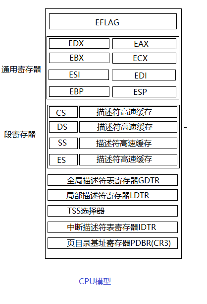

1. TSS选择器就是刚才用ltr指令设置的。中断发生时，自动通过该寄存器找到TSS结构（JOS中是ts这个变量），将栈寄存器SS和ESP分别设置为其中的SS0和ESP0两个字段的值，这样栈就切换到了内核栈。
2. GDTR就是全局描述符表寄存器，之前已经设置过了。
3. PDBR是页目录基址寄存器，通过该寄存器找到页目录和页表，将虚拟地址映射为物理地址。
4. IDTR是中断描述符表寄存器，通过这个寄存器中的值可以找到中断表。

---

## Types of Exceptions and Interrupts

X86处理器内部生成的所有同步异常都使用0到31之间的中断向量，因此映射到IDT项0-31。例如，缺页中断就是14号。大于31的中断向量使用于软件中断，软件中断可以由int指令生成，或者在外部设备需要注意时由外部设备引起异步硬件中断。

在本节中，我们将扩展Jos以处理内部生成的x86异常向量0-31。在下一节中，我们将使用Jos处理软件中断向量48(0x30)，Jos(相当任意)使用其作为系统调用中断向量。在实验4中，我们将扩展Jos以处理外部生成的硬件中断，例如时钟中断。

---

## An Example

假设处理器在用户环境中执行代码，并遇到试图除以零的除法指令。

1. 处理器切换到TSS的SS0和ESP0字段定义的堆栈，这两个字段在Jos中将分别保存GD_KD和KSTACKTOP值。
2. 处理器将异常参数压入到内核堆栈上，从地址KSTACKTOP开始：

                    +--------------------+ KSTACKTOP             
                    | 0x00000 | old SS   |     " - 4
                    |      old ESP       |     " - 8
                    |     old EFLAGS     |     " - 12
                    | 0x00000 | old CS   |     " - 16
                    |      old EIP       |     " - 20 <---- ESP 
                    +--------------------+             

3. 除以0的异常中断号是0，处理器读取IDT的第0项，并设置CS:EIP。
4. 异常处理函数控制并处理这个异常，通过例如终止这个用户环境等方式。

对于某些类型的x86异常，除了压入上图“标准”的5个字之外，处理器还将包含错误码的另一个字压入堆栈。请参阅80386手册，以确定处理器推送错误码的异常号，以及错误码在这种情况下意味着什么。堆栈在异常处理程序的开头如下所示：

                    +--------------------+ KSTACKTOP             
                    | 0x00000 | old SS   |     " - 4
                    |      old ESP       |     " - 8
                    |     old EFLAGS     |     " - 12
                    | 0x00000 | old CS   |     " - 16
                    |      old EIP       |     " - 20
                    |     error code     |     " - 24 <---- ESP
                    +--------------------+             

上面的是处理器在发生中断时自动压入堆栈的。而在我看了源码之后，最完整的过程应该是如下所示，后面的那些状态信息是由我们自己写代码压入堆栈的。

                    +--------------------+ KSTACKTOP             
                    | 0x00000 | old SS   |     " - 4
                    |      old ESP       |     " - 8
                    |     old EFLAGS     |     " - 12
                    | 0x00000 | old CS   |     " - 16
                    |      old EIP       |     " - 20
                    |     error code     |     " - 24
                    |     trap number    |     " - 28
                    |      old DS        |     " - 32
                    |      old ES        |     " - 36
                    |      old AX        |     " - 40
                    |      old CX        |     " - 44
                    |      old DX        |     " - 48
                    |      old BX        |     " - 52
                    |      old ESP       |     " - 56    /* Useless */
                    |      old EBP       |     " - 60
                    |      old ESI       |     " - 64
                    |      old EDI       |     " - 68 <---- ESP
                    +--------------------+             
    地址4和8处的寄存器，只在切换了状态（比如从用户态变成内核态）时才压入。
    地址12到24处的是x86硬件定义的。
    地址28到68处的是我们自己写的代码压入的堆栈。
    为什么要这样压入堆栈，因为这刚好和Trapframe的定义对上了，可以查看源码。

---

## Nested Exceptions and Interrupts (Nested意为嵌套)

处理器在用户态下和内核态下都可以处理异常和中断。但是，只有当从用户模式进入内核模式时，x86处理器才会自动切换堆栈，然后将其旧的寄存器状态压入堆栈，并通过IDT调用相应的异常处理函数。如果当中断或异常发生时，处理器已经处于内核模式(CS寄存器的低2位已经为零)，那么CPU只需在同一个内核堆栈上压入更多的值，而我们在trap函数写的代码也不用将 Trapframe 的值赋值给当前 Env 的 Trapframe 。这样，内核就可以优雅地处理由内核内部代码引起的嵌套异常。此功能是实现保护的重要工具，我们将在后面关于系统调用的部分中看到这一点。

如果处理器已经处于内核模式，并遇到嵌套异常，因为它不需要切换堆栈，所以它不会保存旧的SS或ESP寄存器。如果这个异常类型不压入错误码，内核堆栈在进入异常处理程序时如下所示：

                    +--------------------+ <---- old ESP
                    |     old EFLAGS     |     " - 4
                    | 0x00000 | old CS   |     " - 8
                    |      old EIP       |     " - 12
                    +--------------------+             

对于需要压入错误码的异常，处理器如前所述在压入旧EIP之后立即压入错误码。

警告：如果处理器处于内核模式时遇到异常，并且由于缺乏堆栈空间等原因无法将其旧状态信息（比如寄存器值）压入内核堆栈，那么处理器就无法恢复原来状态，它只能自动重启。不用说，内核的设计应该使这种情况不会发生。

---

## Setting Up the IDT

[如果想知道各个中断具体是什么，可以看这个。](https://pdos.csail.mit.edu/6.828/2018/readings/i386/s09_08.htm)

注意，其它机器的中断可能是不一样的！！！

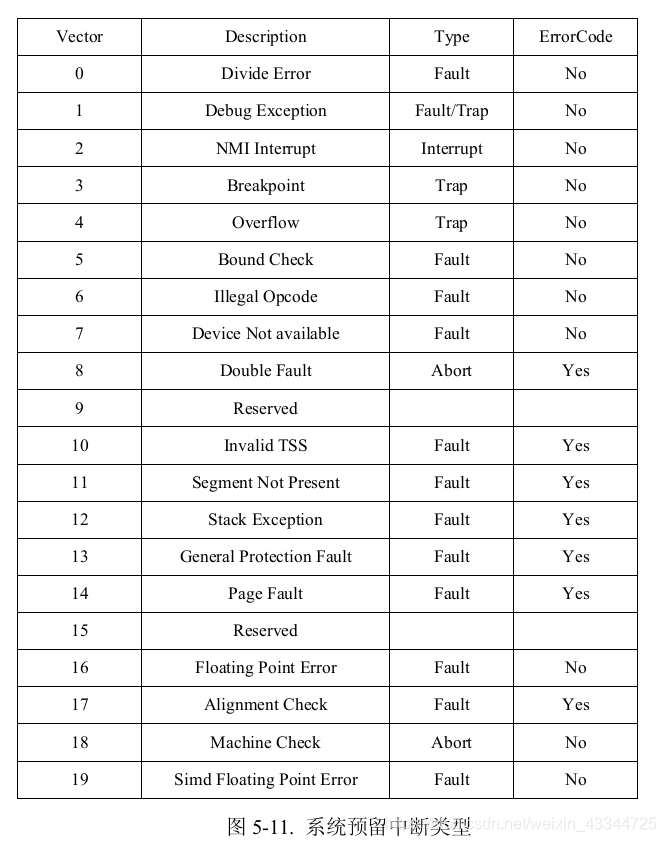

[如果想知道堆栈切换具体流程，可以看这个。](https://blog.csdn.net/cinmyheart/article/details/45270559)

你要实现的代码的效果如下： 
          
            IDT             trapentry.S                 trap.c

    +----------------+                        
    |   &handler1    |-----> handler1:          trap (struct Trapframe *tf)
    |                |      // do stuff         {
    |                |      call trap           //handle the exception/interrupt
    |                |      // ...              }
    +----------------+
    |   &handler2    |-----> handler2:
    |                |      // do stuff
    |                |      call trap
    |                |      // ...
    +----------------+
            .
            .
            .
    +----------------+
    |   &handlerX    |-----> handlerX:
    |                |      // do stuff
    |                |      call trap
    |                |      // ...
    +----------------+

每一个中断或异常都有它自己的中断处理函数，分别定义在 trapentry.S中，trap_init()将初始化IDT表。每一个处理函数都应该构建一个结构体 Trapframe 在堆栈上，并且调用trap()函数且其参数为这个结构体，trap()然后处理异常/中断，或分派到特定的处理函数。

所以整个操作系统的中断控制流程为：

1. trap_init() 先将所有中断处理函数的起始地址放到中断向量表IDT中。
2. 当中断发生时，不管是外部中断还是内部中断，处理器捕捉到该中断，进入内核态，根据中断向量去查询中断向量表，找到对应的表项
3. 保存被中断的程序的上下文到内核堆栈中，调用这个表项中指明的中断处理函数。
4. 执行中断处理函数。
5. 执行完成后，恢复被中断的进程的上下文，返回用户态，继续运行这个进程。

在设置中断向量表中的中断门时，包括两个概念：
* 中断门（Interrupt gate）：进入中断后寄存器eflags的IF位自动清零以屏蔽中断，返回用户态恢复寄存器时恢复IF位
* 陷阱门（Trap gate）：进入中断后不改变IF位
* 两者唯一区别就是 IF (the interrupt-enable flag)

注意：这里的中断门和陷阱门与中断类型里的“陷阱”和“中断”是两个概念，这两个门是在设置中断向量表时自定义的两个行为。而x86系统预留中断类型的type实际上是异常，比如系统预留中断 0-19 有的是 trap 有的是 interrupt ，但是它们都要通过中断门实现。若想内核的逻辑比较简单，就可以禁止中断嵌套，把所有的中断描述符都设置为“中断门”；若设计的内核比较复杂，就可以允许部分中断的中断嵌套，设置它为“陷阱门”。

异常包括：
* 故障（fault）：中断返回后重新执行引起故障的指令（例如页面错误，经过修复后重新访问该页面）
* 陷阱（trap）：中断返回后执行下一条指令（一般用于用户自发地陷入内核态，比如断点）
* 中止（abort）：严重的系统错误，程序中止

实现过程中还要了解 [调用门与特权级（CPL、DPL和RPL）](https://www.cnblogs.com/chenwb89/p/operating_system_004.html)，注意调用门可以安装在GDT或者LGT中，但是不能安装在IDT中，所以我们实现的时候，要加上特权级作为函数参数。

总的流程如下

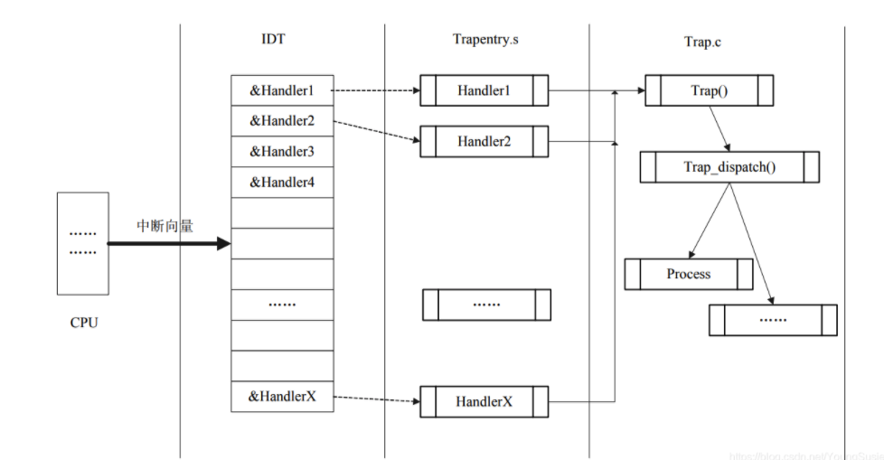

比如lab/user/hello.c的umain函数只有如下两行代码

    cprintf("hello, world\n");
    cprintf("i am environment %08x\n", thisenv->env_id);

其流程实际为：

    umain --> lib/cprintf --> vcprintf --> lib/systemcall/sys_cputs --> syscall，systemcall 中使用 int 0x30 陷入内核态

---

## 看到别人实现的部分骚操作（不过影响可读性和可拓展性？）

宏定义关于 # 和 ## 和 #@ 的相关资料：

https://blog.csdn.net/wsclinux/article/details/50013973
https://blog.csdn.net/viven_hui/article/details/117331811
https://blog.csdn.net/qq_39987383/article/details/106525465

重点关注它的头文件和宏定义的使用。

新建一个文件kern/trapentry.inc，列出以下各项。

TH(n)表示不会产生error-code的第n号中断的trap handler；

THE(n)表示会产生error-code的第n号中断的trap handler。

    TH(0)
    TH(1)
    TH(2)
    TH(3)
    TH(4)
    TH(5)
    TH(6)
    TH(7)
    THE(8)
    THE(10)
    THE(11)
    THE(12)
    THE(13)
    THE(14)
    TH(16)
    THE(17)
    TH(18)
    TH(19)
    TH(48)

在kern/trapentry.S中定义TH和THE，引入kern/trapentry.inc，构成各个中断处理例程：

    #define TH(n) \
    TRAPHANDLER_NOEC(handler##n, n)

    #define THE(n) \
    TRAPHANDLER(handler##n, n)

    .text

    #include <kern/trapentry.inc>

在kern/trap.c中定义TH和THE，引入kern/trapentry.inc，构成中断向量表：

    #define TH(n) extern void handler##n (void);
    #define THE(n) TH(n)

    #include <kern/trapentry.inc>

    #undef THE
    #undef TH

    #define TH(n) [n] = handler##n,
    #define THE(n) TH(n)

    static void (* handlers[256])(void) = {
    #include <kern/trapentry.inc>
    };

    #undef THE
    #undef TH

    //最关键的初始化
    void trap_init(void)
    {
        extern struct Segdesc gdt[];
        
        // LAB 3: Your code here.
        for (int i = 0; i < 32; ++i) 
            SETGATE(idt[i], 0, GD_KT, handlers[i], 0);
        SETGATE(idt[T_BRKPT], 0, GD_KT, handlers[T_BRKPT], 3);
        SETGATE(idt[T_SYSCALL], 0, GD_KT, handlers[T_SYSCALL], 3);
        // Per-CPU setup 
        trap_init_percpu();
    }

---

## 学习一点汇编高级用法

trapentry.S里的一堆宏是没办法压缩的，但能通过一些方法压缩trap_init()的代码，用循环自动填充

首先在宏调用之前：

    .data
        .global funs
        funs:

然后宏里面：

    .data 
        .long name

所有.data节会合并。每次宏展开时，.data 段里的 .long name 会合并到 funs 里作为函数数组，因此在 trap_init 里用 extern char funs[] 然后用 funs[i] 作为每个函数地址访问即可。对于几个空缺的中断号，以及结尾，可以插入 .long -1 或 .long 0 之类的进行辨别，然后在循环中根据 funs[i] 的值特殊处理。

---

## partA整理

1. 首先计算机的开始是从BIOS开始,BIOS会做一些关于硬件的检查，以及初始化之后。它搜索可引导设备，如软盘，硬盘驱动器或CD-ROM。 最终，当它找到可启动磁盘时，BIOS将引导加载程序从磁盘读取。随后转移到引导启动程序上去。
2. 而主引导程序所在地址就是0x7c00也就是boot/boot.S
3. 主引导程序会把处理器从实模式转换为32bit的保护模式，因为只有在这种模式下软件可以访问超过1MB空间的内容。
4. 随后主引导程序会load内核。会把内核load到0x10000处
5. 随后到内核执行，内核调用i386_init随即转移到c语言中
6. 在i386_init中我们要调用各种初始化。有lab1实现的cons_init和lab2实现的mem_init
7. 以及lab3实现的env_init和trap_init。
8. 随后我们要调用env_run不过在调用env_run之前要先调用ENV_CREATE(user_hello, ENV_TYPE_USER)。
9. ENV_CREATE根据提供的二进制elf文件创建一个env。
10. 随后调用env_run执行我们刚才创建的env(这个时候我们只有一个env)
11. 这个时候我们进入env_run继续跟踪。在调用env_pop_tf之前我们输出当前的env_tf
    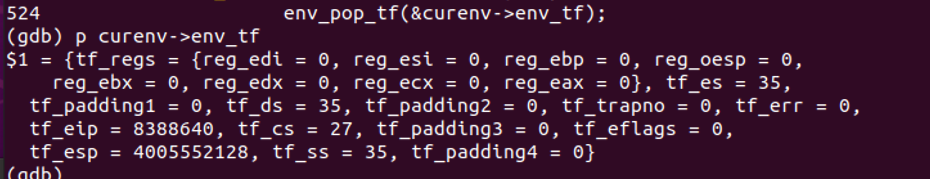

12. 进入env_pop_tf之后我们把当前的env_tf存取trapframe中.然后执行iret指令进入用户态
13. 用户态的第一条指令就是label start in lib/entry.S ，首先会比较一下esp寄存器的值是否小于用户栈。因为这表示我们已经处于用户态。
    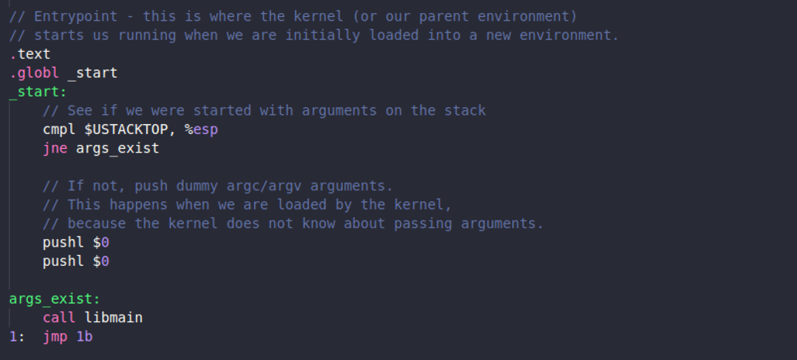
    
    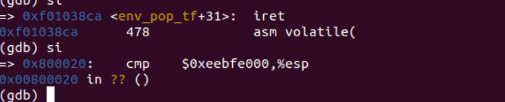

14. 随后调用libmain然后进入lib/libmain.c。在此调用umain(argc, argv);进入user routine。如果是shell的话就会进入shell
15. 这里我们测试用的是一个hello.c在里面我们会cprinf很多东西，而cprinf会陷入系统调用。
16. 这里我们直接在obj/user/hello.asm去找一下系统调用的地址吧。。一行一行执行好慢。。。。
17. 这里通过系统调用我们就会陷入
    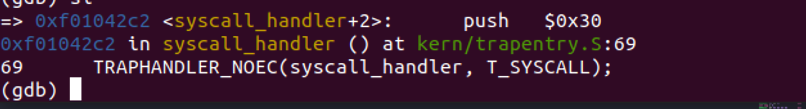

    可以发现这里就是我们刚才设置的对于syscall的处理。

    这里是如何准备准确的找到trapentry.S中对应的条目，是通过我们在前面trap_init设置好的IDT表来找到对应的entry

    所以通过IDT和我们设置的段选择子(其实这里就是内核的代码段)以及偏移就可以找到对应的中断处理程序。

    

    因此这里我们进入TRAPHANDLER_NOEC的宏定义。因为syscall是没有error number所以我们进入这个宏定义

18. 进入之后把trap number入栈随即调用trap这个函数
19. 对于trap的实现是后面的lab了,之后在进行整理

# Part B: Page Faults, Breakpoints Exceptions, and System Calls

## Handling Page Faults

当页面错误（page fault，中断向量14）发生时，处理器将导致故障的线性地址（虚拟地址）存放在特殊寄存器cr2中。

---

## The Breakpoint Exception

断点异常（breakpoint，中断向量3）常被调试器用来在程序的断点处，以特殊的1字节int 3软件中断指令替换相关程序指令，从而在程序代码中插入断点。在JOS中我们会把这个异常转化为一个原始伪系统调用以便任何用户环境都能调用到JOS的内核monitor。如果我们认为Jos内核监视器是一个原始调试器，这种用法实际上是合适的。

---

## System calls

用户进程利用系统调用请求内核为它完成一些操作。当用户进程发起系统调用，处理器进入内核态，处理器和内核将保存当前用户进程的上下文状态，内核执行相应代码实现系统调用，然后返回继续执行用户进程的代码。用户如何向内核发起系统调用以及某个特定系统调用的具体用途在不同的操作系统中有很多不同的实现方式。

在JOS系统中，我们会采用int指令触发一个处理器的中断。特别的，我们使用int $0x30作为系统调用中断。我们定义其中断向量为48（0x30），然后需要在中断向量表中初始化它的中断号和入口函数。这个中断不会被硬件触发，所以由用户代码触发中断不会引起歧义。

用户程序会通过寄存器向内核传递系统调用号和参数，这样内核就不需要从用户的堆栈或指令流中获取参数了。

* 系统调用号放在%eax
* 参数（最多五个）分别放在%edx, %ecx, %ebx, %edi, %esi
* 内核的返回值放在%eax

### Exercise 7（记录这个练习的原因是，这个练习算是较为完整的系统调用流程）

如果现在运行的是内核态的程序的话，此时调用了一个系统调用，比如 sys_cputs 函数时，此时不会触发中断，那么系统会直接执行定义在 lib/syscall.c 文件中的 sys_cputs，我们可以看一下这个文件，可以发现这个文件中定义了几个比较常用的系统调用，包括 sys_cputs, sys_cgetc 等等。我们还会发现他们都是统一调用一个 syscall 函数，通过这个函数的代码发现其实它是执行了一个汇编指令。所以最终是这个函数完成了系统调用。 

但是如果是用户态程序呢？这个练习就是让我们编写程序使我们的用户程序在调用系统调用时，最终也能经过一系列的处理最终去执行 lib/syscall.c 中的 syscall 指令。

让我们看一下这个过程，当用户程序中要调用系统调用时，比如 sys_cputs，从它的汇编代码中我们会发现，它会执行一个 int $0x30 指令，这个指令就是软件中断指令，这个中断的中断号就是 0x30，即 T_SYSCALL，所以题目中让我们首先为这个中断号编写一个中断处理函数，我们首先就要在 kern/trapentry.S 文件中为它声明它的中断处理函数，即TRAPHANDLER_NOEC，就像我们为其他中断号所做的那样。　

    kern/trapentry.S
    .....
    TRAPHANDLER_NOEC(t_fperr, T_FPERR)
    TRAPHANDLER(t_align, T_ALIGN)
    TRAPHANDLER_NOEC(t_mchk, T_MCHK)
    TRAPHANDLER_NOEC(t_simderr, T_SIMDERR)

    TRAPHANDLER_NOEC(t_syscall, T_SYSCALL)

    _alltraps
    ....

然后在trap.c 文件中声明 t_syscall() 函数。并且在 trap_init() 函数中为它注册

    kern/trap.c
    
    void
    trap_init(void)
    {
        extern struct Segdesc gdt[];

        ....
        void t_fperr();
        void t_align();
        void t_mchk();
        void t_simderr();

        void t_syscall();
        .....

        SETGATE(idt[T_ALIGN], 0, GD_KT, t_align, 0);
        SETGATE(idt[T_MCHK], 0, GD_KT, t_mchk, 0);
        SETGATE(idt[T_SIMDERR], 0, GD_KT, t_simderr, 0);

        SETGATE(idt[T_SYSCALL], 0, GD_KT, t_syscall, 3);
        // Per-CPU setup 
        trap_init_percpu();
    }

此时当系统调用中断发生时，系统就可以捕捉到这个中断了，中断发生时，系统会调用 _alltraps 代码块，并且最终来到 trap() 函数处，进入trap函数后，经过一系列处理进入 trap_dispatch 函数， 该函数根据中断向量调用 syscall 函数。题目中要求此时我们需要去调用 kern/syscall.c 中的syscall函数，这里注意，这个函数可不是 lib/syscall.c 中的 syscall 函数，但是通过阅读 kern/syscall.c 中的 syscall 程序我们发现，它的输入和 lib/syscall.c 中的 syscall 很像，如下

    kern/syscall.c 中的 syscall ：
    int32_t syscall(uint32_t syscallno, uint32_t a1, uint32_t a2, uint32_t a3, uint32_t a4, uint32_t a5)

    lib/syscall.c 中的 syscall ：
    static inline int32_t syscall(int num, int check, uint32_t a1, uint32_t a2, uint32_t a3, uint32_t a4, uint32_t a5)

所以我们可以假象一下，是不是 lib/syscall.c 中的 syscall 就是一个外壳函数，它的存在就是为了能够调用 kern/syscall.c 的呢？ 我们再继续观察 kern/syscall.c 中的其他函数，会惊人的发现，kern/syscall.c 中的所有函数名和 lib/syscall.c 中的所有函数名都是一样的，只是实现方式不一样。拿 sys_cputs 函数举例。

    kern/syscall.c
    static void sys_cputs(const char *s, size_t len)
    {
        // Check that the user has permission to read memory [s, s+len).
        // Destroy the environment if not:.

        // LAB 3: Your code here.
        user_mem_assert(curenv, s, len, 0);
        // Print the string supplied by the user.
        cprintf("%.*s", len, s);
    }

    lib/syscall.c
    void sys_cputs(const char *s, size_t len)
    {
        syscall(SYS_cputs, 0, (uint32_t)s, len, 0, 0, 0);
    }

可见在 lib/syscall.c 中，是直接调用 lib/syscall.c/syscall 函数, 把相应参数传给 AX ,DX, CX, BX, DI, SI，然后进行系统调用中断，进入内核态，并且调用 kern/syscall.c/syscall 函数。

所以剩下的就是我们如何在 kern/syscall.c 中的 syscall() 函数中正确的调用 sys_cputs 函数了，当然 kern/syscall.c 中其他的函数也能完成这个功能。所以我们必须根据触发这个系统调用的指令到底想调用哪个系统调用来确定我们该调用哪个函数。

那么怎么知道这个指令是要调用哪个系统调用呢？答案是根据 syscall 函数中的第一个参数，syscallno，那么这个值其实要我们手动传递进去的，这个值存在哪里？通过阅读 lib/syscall.c 中的syscall函数我们可以知道它存放在 eax 寄存器中。

    假如我们向打印字符到控制台，整个递归流程如下

    user/hello.c/umain --> 
    lib/printf.c/cprintf --> 
    lib/printf.c/vcprintf --> 
    lib/syscall.c/sys_cputs --> 
    lib/syscall.c/syscall（将系统调用号放入 AX，五个参数依次放入 DX, CX, BX, DI, SI，然后执行指令 int 0x30 进入内核态，发生中断后，去IDT中查找中断处理函数） --> 
    kern/trap.c/trap（将 Trapframe 结构直接赋值给当前 Env 结构中的 Trapframe ，这样进程下一次恢复运行将会从引起中断的地方之后第一条指令开始） --> 
    kern/trap.c/trap_dispatch（根据中断号 0x30，又会调用 kern/syscall.c 中的 syscall 函数） --> 
    kern/syscall.c/syscall --> 
    kern/syscall.c/sys_cputs -->
    kern/printf.c/cprintf --> 
    kern/printf.c/vcprintf -->
    kern/console.c/cputchar -->

    当递归返回，到trap_dispatch()返回时，trap()会调用env_run(curenv)；该函数会将 curenv->env_tf 结构中保存的寄存器快照重新恢复到寄存器中，这样又会回到用户程序系统调用之后的那条指令运行（在本例中，就算打印完字符之后的第一条指令），只是这时候已经执行了系统调用并且寄存器eax中保存着系统调用的返回值。任务完成重新回到用户模式CPL=3。

    我一开始很疑惑，在整个过程，好像没有改变什么全局变量来标记现在是用户态还是内核态？那是因为内核态和用户态区别在于权限级别，而调用门实现了在不同特权级之间实现受控的程序控制转移的功能，调用门通常仅用于使用特权级保护机制的操作系统中。

    所以当前 Env 的 Trapframe 结构的 tf_cs 的前两位始终都是1，也就是用户级别权限。用户想要系统调用，那么只能通过调用门，在不改变当前进程的权限的情况下（如果系统调用会改变当前进程权限，那进程岂不是可以趁着这段时间为所欲为！！），辅助实现系统调用（也就是暂时进入了内核态，拥有了小部分用户态没有的权限）。
    
---

## User-mode startup

