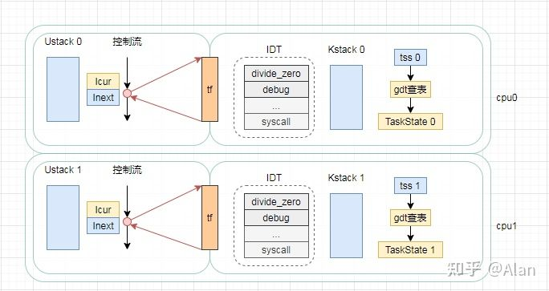
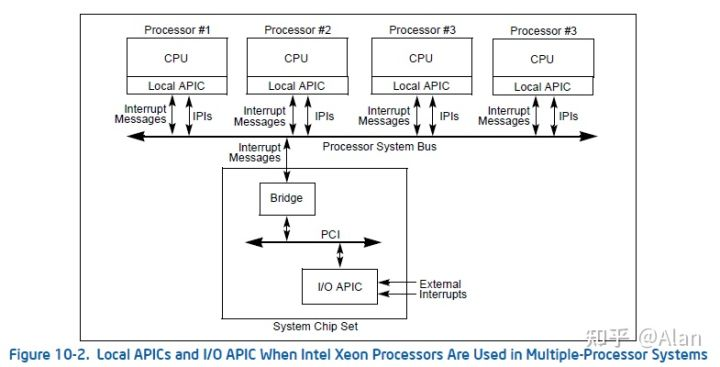
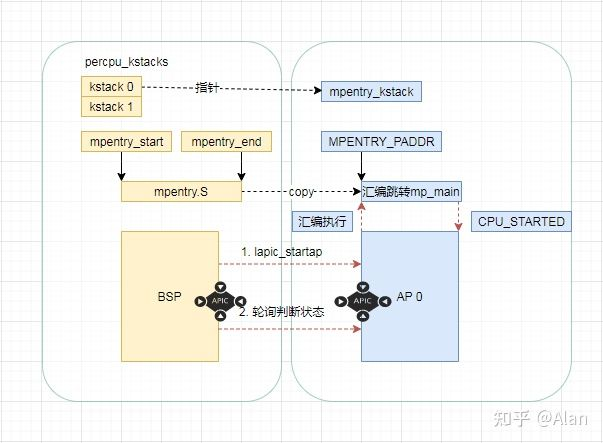
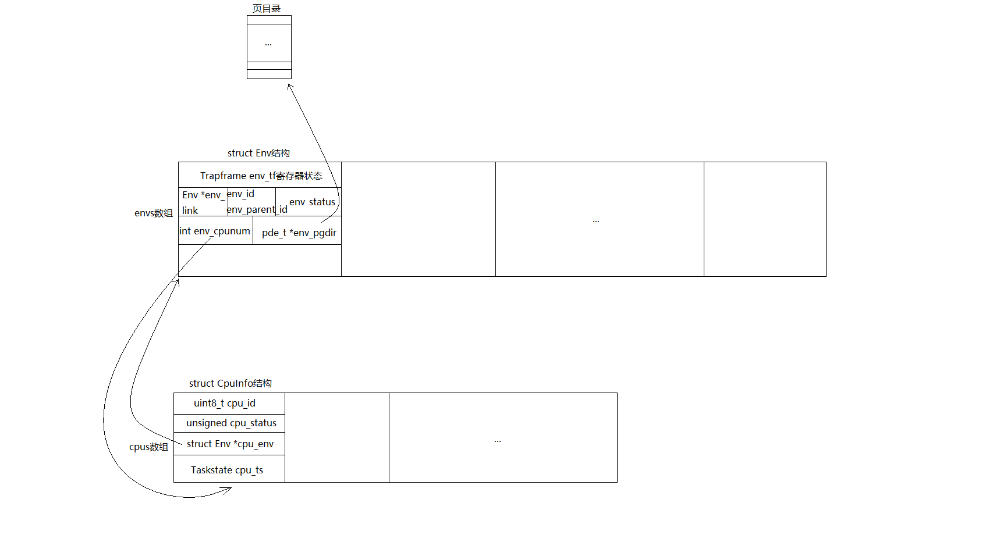

# Introduction

注：根据MIT-JOS的lab指导手册，以下不明确区分“环境”和“进程”

在这次试验中，我们将在同时运行的多用户环境实现协作式轮询调度（cooperative round-robin scheduling）和抢占式调度（preemptive scheduling），扩展JOS使之能在多处理器系统上运行。 

1. PartA:
   * 为JOS增添多处理器支持特性，实现并行（需要用锁解决多CPU的竞争。介绍了spin lock和sleep lock，并给出了spin lock的实现）。
   * 实现协作式轮询调度（cooperative round-robin scheduling）。
   * 添加基本的环境（进程）管理系统调用（创建和销毁环境，分配和映射内存）。

2. PartB:
    * 实现一个类Unix的fork(),其允许一个用户模式的环境能创建一份它自身的拷贝。

3. PartC:
   * 实现抢占式调度（preemptive scheduling）
   * 支持进程间通信（inter-process communication, IPC）
   * 支持硬件时钟中断和抢占

# 本实验添加的重要文件

    kern/cpu.h	
    Kernel-private definitions for multiprocessor support
    kern/mpconfig.c	
    Code to read the multiprocessor configuration
    kern/lapic.c	
    Kernel code driving the local APIC unit in each processor
    kern/mpentry.S	
    Assembly-language entry code for non-boot CPUs
    kern/spinlock.h	
    Kernel-private definitions for spin locks, including the big kernel lock
    kern/spinlock.c	
    Kernel code implementing spin locks
    kern/sched.c	
    Code skeleton of the scheduler that you are about to implement

# Part A: Multiprocessor Support and Cooperative Multitasking

## Multiprocessor Support

我们要使Jos支持“对称多处理”（symmetric multiprocessing , SMP）这种多处理器模型，其中所有CPU都能对系统资源（如内存和I/O总线）有等同权限的访问。虽然所有CPU在SMP中的功能上相同，但在boot过程中它们可以分为两种类型：引导处理器（bootstrap processor , BSP）负责初始化系统和引导操作系统；应用程序处理器（application processors , APs）只有在操作系统启动和运行后才由BSP激活。哪个处理器是BSP由硬件和BIOS决定。之前的所有代码都是在BSP上实现的。

关于SMP的知识可以参考：
* https://pdos.csail.mit.edu/6.828/2018/readings/ia32/MPspec.pdf
* https://wenku.baidu.com/view/615ea3c6aa00b52acfc7ca97.html

在SMP系统中，每个CPU都有对应的一个局部高级可编程中断控制器（local Advanced Programmable Interrupt Controller，LAPIC）单元，它负责为整个系统发送中断信号。LAPIC还为它所关联的CPU提供唯一标识符。在本实验室中，我们使用了LAPIC单元的以下基本功能（kern/lapic.c）：
* 读取LAPIC标识符（APIC ID），获取当前代码运行的CPU（ cpunum() ）。
* 从BSP向APs发送STARTUP的处理器间中断信号（interprocessor interrupt，IPI），来唤醒其他CPU（ lapic_startap() ）（IPI：在SMP环境下，可以被任意一个处理器用来对另一个处理器产生中断）。
* 在part C中，我们将对LAPIC单元的内置计时器进行编程，以触发时钟中断来支持抢占式多任务处理（ apic_init() ）。

程序使用内存映射I/O（memory-mapped I/O ，MMIO）访问它的LAPIC。在MMIO中，部分物理内存器被硬连接到一些I/O设备的寄存器，因此通常用于访问内存的指令load/store也可用于访问设备寄存器。在之前的实验中，IO hole就在0xA0000开始的物理地址中（0xA0000-0xC0000存放VGA显示缓存）。LAPIC开始于物理地址0xFE000000（4GB之下的32MB）处。在kernel初始化期间我们仅对物理内存的0-0x0FFFFFFF（前256MB）映射到虚拟内存的0xF0000000-0xFFFFFFFF，LAPIC的物理地址显然太高了，因此JOS虚拟内存映射预留了MMIOBASE起始的4MB内存用于映射这类设备。之后的实验中还会引入更多的MMIO区域，我们需要实现一个函数来分配这部分区域并映射到I/O设备对应的内存。

---

## Application Processor Bootstrap

在启动APs之前，BSP应该首先收集有关多处理器系统的信息，例如CPU的总数、它们的APIC ID和LAPIC单元的MMIO地址。mp_init()函数会从BIOS中读取这些信息。

mp_init()函数会在进入内核后被i386_init()调用，主要作用就是读取mp configuration table中保存的CPU信息，初始化cpus数组，ncpu（总共多少可用CPU），bootcpu指针（指向BSP对应的CpuInfo结构）。

boot_aps函数(在kern/init.c中)驱动AP引导进程。AP以实模式启动，就像bootloader在boot/boot.S中启动一样，所以boot_aps将AP入口代码(kern/mpentry.S)复制到可在实模式下寻址的内存位置。与bootloader不同的是，我们对于AP入口代码存放的位置可以有一定控制权；在jos中使用0x7000(MPENTRY_PADDR)作为入口地址的存放位置，但是实际上任何未使用的、页面对齐的低于640 KB的物理地址都可以工作。

之后，boot_aps函数会遍历cpus数组，向对应AP的LAPIC单元发送STARTUP的IPI信号（处理器间中断），使用AP的entry code初始化其CS:IP地址（在这里我们就使用MPENTRY_PADDR）依次激活APs。在一些简短的配置后，entry code使AP进入开启分页机制的保护模式，然后调用在kern/init.c中的启动例程mp_main。boot_aps函数在唤醒下一个AP之前会等待当前AP发出一个CPU_STARTED启动标记，这个标记位在struct CpuInfo中的cpu_status字段。

当一个AP启动后会执行kern/mpentry.S中的代码。

mpentry.S做的事与boot.S类似：
* 初始化各寄存器
* 加载GDT表
* 设置cr0进入实模式
* 载入简易页表
* 设置cr3和cr0进入分页保护模式
* 初始化堆栈
* 调用c语言编写的MP初始化函数mp_main()

在mp_main()中做的事如下：
* 设置页表目录为kern_pgdir
* 建立内存映射I/O，使能够访问当前CPU的LAPIC
* 初始化当前CPU的环境（GDT表）
* 初始化当前CPU的TSS
* 设置当前CPU的状态cpu_status为CPU_STARTED
* 进入自旋

---

## Per-CPU State and Initialization

当编写一个多处理器操作系统时，区分每个CPU的私有状态（per-CPU state）和整个系统共享的全局状态（global state）非常重要。kern/cpu.h定义了CPU的大部分私有状态。我们使用struct CpuInfo cpus[]数组存放每个CPU的私有状态，使用cpunum()获取当前CPU的ID（即它在cpus数组中的下标），使用thiscpu宏获取当前CPU的CpuInfo结构在cpus中的地址

重要的CPU私有状态（per-CPU state）列举如下：

* Per-CPU 内核栈：由于多CPU可能同时陷入内核态，因此我们需要为它们各自分配独立的内核栈空间，以防止它们干扰彼此的执行。数组percpu_kstacks[NCPU][KSTKSIZE]为最多NCPU个CPU保留了内核栈空间。lab2中我们将BSP的内核栈映射到KSTACKTOP下方KSTKSIZE大小处，现在对每个AP的栈空间都要映射到这个区域，每两个栈之间预留KSTKGAP大小的内存作为避免溢出的缓冲区。
* Per-CPU 的TSS和TSS描述符：每个CPU都有一个任务状态段（TSS）指出该CPU对应的内核栈的位置。对于CPU i，它的TSS存放在cpus[i].cpu_ts中，并定义TSS段描述符在它对应的GDT表中gdt[(GD_TSS0 >> 3) + i]，之前定义在kern/trap.c中的struct Taskstate ts不再有用。
* Per-CPU 的当前环境指针：由于多个CPU能同时运行它们各自的用户环境，因此我们重新定义curenv为cpus[cpunum()].cpu_env（或thiscpu->cpu_env），它指向当前CPU（代码正在运行的CPU）上正在运行的环境（在代码中，利用宏将curenv全部展开为thiscpu->cpu_env，因此代码逻辑完全不变）
* Per-CPU 的系统寄存器：包括系统寄存器在内的所有寄存器是CPU私有的，因此初始化这些寄存器的指令（例如lcr3(), ltr(), lgdt(), lidt()等）必须在每个CPU上各执行一次，env_init_percpu()和trap_init_percpu()的目的就在于此

---

## Locking

* i386_init()中：在BSP启动其他CPU前获得锁
* mp_main()中：初始化AP后获得锁，并调用sched_yield()运行AP的环境
* trap()中：从用户态陷入内核态时获得锁。利用tf_cs检查异常是用户态发生的还是内核态发生的
* env_run()中：在切换到用户态运行前释放锁

首先在BSP启动AP前，即boot_aps()前加锁，在BSP准备进入自己的用户环境前解锁。因为BSP启动和初始化AP及它创建、启动自己的环境都是在内核态发生的，这之间对内核的访问权都应该属于BSP。在BSP进入到用户态、释放锁之前，所有AP在等待锁

BSP释放锁后，只有一个AP能获得锁并创建、运行它的环境，然后释放锁；其他AP等待上一个AP释放锁后再依次获得锁创建、运行环境

在这套逻辑下，如果发生了中断或异常，若发生时处在内核态，则一定获得过大内核锁，（除非是在启动任何一个AP前，即只有BSP运行时，此时不会有竞争发生，也没必要加锁），在trap()中不需要再次加锁；否则，它就是从用户态因为异常陷入了内核态，为了防止其他用户态在它处理异常时陷入内核态发生竞争，需要给他加个锁

    似乎使用大内核锁可以保证一次只能运行一个CPU代码。为什么每个CPU仍然需要单独的内核堆栈？描述一个使用共享内核堆栈将出错的场景，即使在保护大内核锁的情况下也是如此。

    大内核锁是加在trap()函数里的。在中断触发、进入中断处理程序入口到trap()之间是没有锁的，但程序已经通过TSS寻找到内核栈，并向内核栈压入中断号、错误码以及各寄存器参数。如果没有为各CPU区分内核栈，若多个CPU同时触发异常陷入内核态，压栈过程将会冲突造成混乱。

---

## Round-Robin Scheduling

Round-Robin Scheduling的相关知识没什么难点，这里就不做笔记了。

问题1：

    由于每次调用env_run()函数，都要调用lcr3()函数，改变当前页目录基址寄存器，为什么对于env_run()函数的参数Env* e，e这个指针还是不用改变，其虚拟地址依然正确呢？
    
    因为什么环境啊、cpu啊、中断啊啥的，kernel的虚拟内存初始化过程中已经完成了对它们的物理地址的映射，而且映射到它们的物理地址的虚拟地址基本都是一样的，而其虚拟地址在KERNBASE（0xf0000000）以上，属于内核空间。

    更具体的，拿环境举例子，在每个新的环境被创建时，调用了env_setup_vm()初始化新环境的页表，其中有一段代码为
    for (i=PDX(UTOP); i<NPDENTRIES; i++)
        e->env_pgdir[i] = kern_pgdir[i];
    e->env_pgdir[PDX(UVPT)] = PADDR(e->env_pgdir) | PTE_P | PTE_U;
    
    每个进程页表中虚拟地址高于UTOP之上的地方，只有UVPT不一样，其余的都是一样的，只不过用户对其没有访问权限，但env_run()处于内核态，在切换了cr3的值之后对kernel内部变量的映射关系没有改变且仍有权限继续访问，因此不会出错。

问题2：

    当内核进行用户环境切换的时候，必须要保证旧的环境的寄存器值被保存起来以便之后恢复。这个过程是在哪里发生的？

    旧寄存器的值放在旧环境的e->env_tf。一个进程通过系统调用陷入内核态，因此会经历中断触发的过程，即在trapentry.S中保存寄存器的值到它的内核栈，然后将内核栈的这些值作为参数tf调用trap()，并在函数中赋值给curenv->env_tf；当一个环境恢复执行时，通过env_pop_tf(&curenv->env_tf);恢复该环境结构体中的env-tf到相应寄存器。

---

## System Calls for Environment Creation

