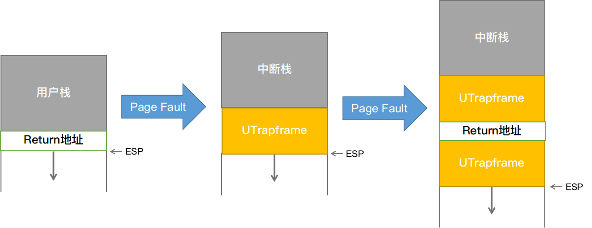

# Introduction

注：根据MIT-JOS的lab指导手册，以下不明确区分“环境”和“进程”

在这次试验中，我们将在同时运行的多用户环境实现协作式轮询调度（cooperative round-robin scheduling）和抢占式调度（preemptive scheduling），扩展JOS使之能在多处理器系统上运行。 

1. PartA:
   * 为JOS增添多处理器支持特性，实现并行（需要用锁解决多CPU的竞争。介绍了spin lock和sleep lock，并给出了spin lock的实现）。
   * 实现协作式轮询调度（cooperative round-robin scheduling）。
   * 添加基本的环境（进程）管理系统调用（创建和销毁环境，分配和映射内存）。

2. PartB:
    * 实现一个类Unix的fork(),其允许一个用户模式的环境能创建一份它自身的拷贝。

3. PartC:
   * 实现抢占式调度（preemptive scheduling）
   * 支持进程间通信（inter-process communication, IPC）
   * 支持硬件时钟中断和抢占

# 本实验添加的重要文件

    kern/cpu.h	
    Kernel-private definitions for multiprocessor support
    kern/mpconfig.c	
    Code to read the multiprocessor configuration
    kern/lapic.c	
    Kernel code driving the local APIC unit in each processor
    kern/mpentry.S	
    Assembly-language entry code for non-boot CPUs
    kern/spinlock.h	
    Kernel-private definitions for spin locks, including the big kernel lock
    kern/spinlock.c	
    Kernel code implementing spin locks
    kern/sched.c	
    Code skeleton of the scheduler that you are about to implement

# Part A: Multiprocessor Support and Cooperative Multitasking

## Multiprocessor Support

我们要使Jos支持“对称多处理”（symmetric multiprocessing , SMP）这种多处理器模型，其中所有CPU都能对系统资源（如内存和I/O总线）有等同权限的访问。虽然所有CPU在SMP中的功能上相同，但在boot过程中它们可以分为两种类型：引导处理器（bootstrap processor , BSP）负责初始化系统和引导操作系统；应用程序处理器（application processors , APs）只有在操作系统启动和运行后才由BSP激活。哪个处理器是BSP由硬件和BIOS决定。之前的所有代码都是在BSP上实现的。

关于SMP的知识可以参考：
* https://pdos.csail.mit.edu/6.828/2018/readings/ia32/MPspec.pdf
* https://wenku.baidu.com/view/615ea3c6aa00b52acfc7ca97.html

在SMP系统中，每个CPU都有对应的一个局部高级可编程中断控制器（local Advanced Programmable Interrupt Controller，LAPIC）单元，它负责为整个系统发送中断信号。LAPIC还为它所关联的CPU提供唯一标识符。在本实验室中，我们使用了LAPIC单元的以下基本功能（kern/lapic.c）：
* 读取LAPIC标识符（APIC ID），获取当前代码运行的CPU（ cpunum() ）。
* 从BSP向APs发送STARTUP的处理器间中断信号（interprocessor interrupt，IPI），来唤醒其他CPU（ lapic_startap() ）（IPI：在SMP环境下，可以被任意一个处理器用来对另一个处理器产生中断）。
* 在part C中，我们将对LAPIC单元的内置计时器进行编程，以触发时钟中断来支持抢占式多任务处理（ apic_init() ）。

程序使用内存映射I/O（memory-mapped I/O ，MMIO）访问它的LAPIC。在MMIO中，部分物理内存器被硬连接到一些I/O设备的寄存器，因此通常用于访问内存的指令load/store也可用于访问设备寄存器。在之前的实验中，IO hole就在0xA0000开始的物理地址中（0xA0000-0xC0000存放VGA显示缓存）。LAPIC开始于物理地址0xFE000000（4GB之下的32MB）处。在kernel初始化期间我们仅对物理内存的0-0x0FFFFFFF（前256MB）映射到虚拟内存的0xF0000000-0xFFFFFFFF，LAPIC的物理地址显然太高了，因此JOS虚拟内存映射预留了MMIOBASE起始的4MB内存用于映射这类设备。之后的实验中还会引入更多的MMIO区域，我们需要实现一个函数来分配这部分区域并映射到I/O设备对应的内存。

---

## Application Processor Bootstrap

在启动APs之前，BSP应该首先收集有关多处理器系统的信息，例如CPU的总数、它们的APIC ID和LAPIC单元的MMIO地址。mp_init()函数会从BIOS中读取这些信息。

mp_init()函数会在进入内核后被i386_init()调用，主要作用就是读取mp configuration table中保存的CPU信息，初始化cpus数组，ncpu（总共多少可用CPU），bootcpu指针（指向BSP对应的CpuInfo结构）。

boot_aps函数(在kern/init.c中)驱动AP引导进程。AP以实模式启动，就像bootloader在boot/boot.S中启动一样，所以boot_aps将AP入口代码(kern/mpentry.S)复制到可在实模式下寻址的内存位置。与bootloader不同的是，我们对于AP入口代码存放的位置可以有一定控制权；在jos中使用0x7000(MPENTRY_PADDR)作为入口地址的存放位置，但是实际上任何未使用的、页面对齐的低于640 KB的物理地址都可以工作。

之后，boot_aps函数会遍历cpus数组，向对应AP的LAPIC单元发送STARTUP的IPI信号（处理器间中断），使用AP的entry code初始化其CS:IP地址（在这里我们就使用MPENTRY_PADDR）依次激活APs。在一些简短的配置后，entry code使AP进入开启分页机制的保护模式，然后调用在kern/init.c中的启动例程mp_main。boot_aps函数在唤醒下一个AP之前会等待当前AP发出一个CPU_STARTED启动标记，这个标记位在struct CpuInfo中的cpu_status字段。

当一个AP启动后会执行kern/mpentry.S中的代码。

mpentry.S做的事与boot.S类似：
* 初始化各寄存器
* 加载GDT表
* 设置cr0进入实模式
* 载入简易页表
* 设置cr3和cr0进入分页保护模式
* 初始化堆栈
* 调用c语言编写的MP初始化函数mp_main()

在mp_main()中做的事如下：
* 设置页表目录为kern_pgdir
* 建立内存映射I/O，使能够访问当前CPU的LAPIC
* 初始化当前CPU的环境（GDT表）
* 初始化当前CPU的TSS
* 设置当前CPU的状态cpu_status为CPU_STARTED
* 进入自旋

---

## Per-CPU State and Initialization

当编写一个多处理器操作系统时，区分每个CPU的私有状态（per-CPU state）和整个系统共享的全局状态（global state）非常重要。kern/cpu.h定义了CPU的大部分私有状态。我们使用struct CpuInfo cpus[]数组存放每个CPU的私有状态，使用cpunum()获取当前CPU的ID（即它在cpus数组中的下标），使用thiscpu宏获取当前CPU的CpuInfo结构在cpus中的地址

重要的CPU私有状态（per-CPU state）列举如下：

* Per-CPU 内核栈：由于多CPU可能同时陷入内核态，因此我们需要为它们各自分配独立的内核栈空间，以防止它们干扰彼此的执行。数组percpu_kstacks[NCPU][KSTKSIZE]为最多NCPU个CPU保留了内核栈空间。lab2中我们将BSP的内核栈映射到KSTACKTOP下方KSTKSIZE大小处，现在对每个AP的栈空间都要映射到这个区域，每两个栈之间预留KSTKGAP大小的内存作为避免溢出的缓冲区。
* Per-CPU 的TSS和TSS描述符：每个CPU都有一个任务状态段（TSS）指出该CPU对应的内核栈的位置。对于CPU i，它的TSS存放在cpus[i].cpu_ts中，并定义TSS段描述符在它对应的GDT表中gdt[(GD_TSS0 >> 3) + i]，之前定义在kern/trap.c中的struct Taskstate ts不再有用。
* Per-CPU 的当前环境指针：由于多个CPU能同时运行它们各自的用户环境，因此我们重新定义curenv为cpus[cpunum()].cpu_env（或thiscpu->cpu_env），它指向当前CPU（代码正在运行的CPU）上正在运行的环境（在代码中，利用宏将curenv全部展开为thiscpu->cpu_env，因此代码逻辑完全不变）
* Per-CPU 的系统寄存器：包括系统寄存器在内的所有寄存器是CPU私有的，因此初始化这些寄存器的指令（例如lcr3(), ltr(), lgdt(), lidt()等）必须在每个CPU上各执行一次，env_init_percpu()和trap_init_percpu()的目的就在于此

---

## Locking

* i386_init()中：在BSP启动其他CPU前获得锁
* mp_main()中：初始化AP后获得锁，并调用sched_yield()运行AP的环境
* trap()中：从用户态陷入内核态时获得锁。利用tf_cs检查异常是用户态发生的还是内核态发生的
* env_run()中：在切换到用户态运行前释放锁

首先在BSP启动AP前，即boot_aps()前加锁，在BSP准备进入自己的用户环境前解锁。因为BSP启动和初始化AP及它创建、启动自己的环境都是在内核态发生的，这之间对内核的访问权都应该属于BSP。在BSP进入到用户态、释放锁之前，所有AP在等待锁

BSP释放锁后，只有一个AP能获得锁并创建、运行它的环境，然后释放锁；其他AP等待上一个AP释放锁后再依次获得锁创建、运行环境

在这套逻辑下，如果发生了中断或异常，若发生时处在内核态，则一定获得过大内核锁，（除非是在启动任何一个AP前，即只有BSP运行时，此时不会有竞争发生，也没必要加锁），在trap()中不需要再次加锁；否则，它就是从用户态因为异常陷入了内核态，为了防止其他用户态在它处理异常时陷入内核态发生竞争，需要给他加个锁

    似乎使用大内核锁可以保证一次只能运行一个CPU代码。为什么每个CPU仍然需要单独的内核堆栈？描述一个使用共享内核堆栈将出错的场景，即使在保护大内核锁的情况下也是如此。

    大内核锁是加在trap()函数里的。在中断触发、进入中断处理程序入口到trap()之间是没有锁的，但程序已经通过TSS寻找到内核栈，并向内核栈压入中断号、错误码以及各寄存器参数。如果没有为各CPU区分内核栈，若多个CPU同时触发异常陷入内核态，压栈过程将会冲突造成混乱。

---

## Round-Robin Scheduling

Round-Robin Scheduling的相关知识没什么难点，这里就不做笔记了。

问题1：

    由于每次调用env_run()函数，都要调用lcr3()函数，改变当前页目录基址寄存器，为什么对于env_run()函数的参数Env* e，e这个指针还是不用改变，其虚拟地址依然正确呢？
    
    因为什么环境啊、cpu啊、中断啊啥的，kernel的虚拟内存初始化过程中已经完成了对它们的物理地址的映射，而且映射到它们的物理地址的虚拟地址基本都是一样的，而其虚拟地址在KERNBASE（0xf0000000）以上，属于内核空间。

    更具体的，拿环境举例子，在每个新的环境被创建时，调用了env_setup_vm()初始化新环境的页表，其中有一段代码为
    for (i=PDX(UTOP); i<NPDENTRIES; i++)
        e->env_pgdir[i] = kern_pgdir[i];
    e->env_pgdir[PDX(UVPT)] = PADDR(e->env_pgdir) | PTE_P | PTE_U;
    
    每个进程页表中虚拟地址高于UTOP之上的地方，只有UVPT不一样，其余的都是一样的，只不过用户对其没有访问权限，但env_run()处于内核态，在切换了cr3的值之后对kernel内部变量的映射关系没有改变且仍有权限继续访问，因此不会出错。

问题2：

    当内核进行用户环境切换的时候，必须要保证旧的环境的寄存器值被保存起来以便之后恢复。这个过程是在哪里发生的？

    旧寄存器的值放在旧环境的e->env_tf。一个进程通过系统调用陷入内核态，因此会经历中断触发的过程，即在trapentry.S中保存寄存器的值到它的内核栈，然后将内核栈的这些值作为参数tf调用trap()，并在函数中赋值给curenv->env_tf；当一个环境恢复执行时，通过env_pop_tf(&curenv->env_tf);恢复该环境结构体中的env-tf到相应寄存器。

---

## System Calls for Environment Creation

现在我们的系统已经能够环境运行了但是还是不能用户创建进程，在unix中我们用的fork函数创建进程，所以我们现在要实现一个简单fork函数。为了实现这个函数，我们需要下面这些系统调用。

* sys_exofork：这个系统调用将创建一个新的空白用户环境，没有映射的用户空间且无法运行。在调用函数时新用户环境的寄存器状态与父进程相同。在父用户环境中，会返回子用户环境的envid_t（如果用户环境分配失败，返回一个负值的错误码）。而子用户环境中，会返回0。（由于子用户环境开始标记为不可运行，sys_exofork实际上是不会返回到子用户环境直到父用户环境标记子用户环境可以运行…）
* sys_env_set_status：这个系统调用将特定用户环境的状态设置为ENV_RUNNABLE或者ENV_NOT_RUNNABLE。一旦一个新的用户环境的地址空间和所有寄存器都完全初始化，这个系统调用用来标记这个用户环境准备运行。
* sys_page_alloc：分配一个页的物理内存，并将其映射到给定用户环境地址空间的给定虚拟地址。
* sys_page_map：从一个用户环境拷贝一个页的映射到另外一个用户环境，这样就完成了内存共享，使新旧的映射都是指同一页的物理内存。
* sys_page_unmap：取消给定用户环境给定虚拟地址的映射。

以上所有的系统调用都接收用户环境ID，JOS内核支持将0作为当前运行的用户环境的ID的惯例，这个惯例通过kern/env.c中的envid2env()实现。

    //父进程在dumbfork函数中循环调用duppage函数，dstenv是子进程的id，addr为父进程的UTEXT到USTACKTOP的每个PGSIZE的值，[UTEXT,USTACKTOP)中的每个PGSIZE

    void duppage(envid_t dstenv, void *addr)
    {
        int r;

        // This is NOT what you should do in your fork.
        if ((r = sys_page_alloc(dstenv, addr, PTE_P|PTE_U|PTE_W)) < 0)
            panic("sys_page_alloc: %e", r);
        if ((r = sys_page_map(dstenv, addr, 0, UTEMP, PTE_P|PTE_U|PTE_W)) < 0)
            panic("sys_page_map: %e", r);
        memmove(UTEMP, addr, PGSIZE);
        if ((r = sys_page_unmap(0, UTEMP)) < 0)
            panic("sys_page_unmap: %e", r);
    }

    首先为子进程在addr虚拟地址处分配一个页面，然后将该物理页面映射到父进程的临时交换区UTEMP，这样父进程对UTEMP的写入等于对子进程addr地址处的写入，最后将父进程addr处的数据拷贝到子进程addr处，最后删除UTEMP的映射

    这里要这样写的原因是父进程地址addr和子进程地址addr虽然在地址的值上是相同的，但对应的物理页面是不通的，映射关系也是不同的

duppage示意图

关于BSP和AP的说明可以参考 [x86-64的多核初始化](https://zhuanlan.zhihu.com/p/67989330)

关于Jos多cpu切换的流程分析可以参考 [Xv6学习小记（二）——多核启动](https://blog.csdn.net/coding01/article/details/83057093)

关于Part A的整个流程可以参考 https://www.cnblogs.com/JayL-zxl/p/14998952.html

# Part B: Copy-on-Write Fork

xv6 Unix的fork()实现是：为子进程分配新的页面，并把父进程页面中的所有数据复制到子进程（A部分的dumpfork()函数就是这样做的）。数据的拷贝是fork()过程中代价最大的操作。

然而子进程在调用fork()之后会立刻执行exec()，这样的话，子进程仅在调用exec()前用一下这部分内存，从父进程复制的大部分数据都被浪费了。

因此，后来的Unix版本利用虚拟内存硬件允许父子进程共享映射到各自地址空间的内存，直到某个进程修改了内存，这种技术被成为写时复制（Copy-on-Write）。为此，在fork()函数中，内核只需要拷贝父进程的内存映射(页目录和页表)到子进程就可以了，而不是复制页面内容，并且将共享的页面标记为只读。当父子进程任何一方企图向共享页面写入数据时将会发生page fault，此时内核会意识到这个页面是一个“虚拟的”或“写时复制的”副本，然后给触发异常的进程分配一个私有的可写的和原页面数据相同的新页面，再修改该进程的页表相应的映射就可以了。这样，在实际有数据写入之前并不会发生页面的复制，降低了fork()+exec()调用的代价。

之后，我们将以Copy-on-Write的方式在用户lib里实现一个更好的fork()。在用户空间实现写时拷贝的fork使内核更简单更不容易出错，同时也支持用户程序自定义fork()。

---

## User-level page fault handling

一个用户级别的cow的fork函数需要知道哪些page fault是在写保护页时触发的，写时复制只是用户级缺页中断处理的一种。

内核为进程不同的页面错误执行不同的处理方法。例如kernel初始状态下仅为一个新进程分配一个页面作为堆栈空间，若用户进程需要用到更大的栈空间，则会在未映射过的栈地址处发生一个页面错误。当用户空间的不同区域发生页面错误时，Unix内核必须追踪其发生的错误，并采取不同的行动，例如

* 栈区的页面错误：分配和映射一个新的物理页面
* BSS区域的页面错误：分配和映射一个新的物理页面，并将该页面初始化为0
* 按需分配页面的可执行文件中的text区域发生的错误：从磁盘读取二进制文件的相应页面并映射

---

## Setting the Page Fault Handler

为了处理自己的缺页中断，用户环境需要在JOS内核中注册缺页中断处理程序的入口。用户环境通过sys_env_set_pgfault_upcall系统调用注册它的缺页中断入口。我们在Env结构体中增加了一个新成员env_pgfault_upcall来记录这一信息。当执行env_pgfault_upcall指定位置的代码时，栈已经转到异常栈，并且压入了UTrapframe结构。

练习8就是让你实现缺页中断的入口，就是你用写时复制，如果修改了该怎么处理，调用哪个程序去处理。我们需要去实现这个sys_env_set_pgfault_upcall。

---

## Normal and Exception Stacks in User Environments

正常情况下，用户进程运行在用户栈上，开始运行时ESP指向USTACKTOP，压栈数据位于 [USTACKTOP-PGSIZE,USTACKTOP-1] 之间的区域。当用户模式下页面错误发生时，内核重启用户环境让其在用户异常栈上运行指定的用户级缺页处理程序。我们将使JOS内核代替用户环境实现自动的“栈切换”，就如同x86处理器代替JOS内核实现从用户模式到内核模式的栈切换。

JOS的用户异常栈大小为一个页面，初始栈顶地址为UXSTACKTOP，因此有效的用户异常栈的区间是 [UXSTACKTOP-PGSIZE,UXSTACKTOP-1] 之间的区域。当运行在异常栈时，用户级页面错误处理程序能通过JOS的系统调用分配一个新的页面或调整地址映射来修复页面错误异常。然后用户级别页错误处理程序通过一个汇编语言stub返回到原始栈的错误代码处。

每个支持自定义用户级别页错误处理程序的用户环境都需要为自己的异常栈分配内存，这就用到了在part A中引入的sys_page_alloc()系统调用函数。

---

## Invoking the User Page Fault Handler

您现在需要更改kern/trap.c中的页面错误处理代码，以处理在用户模式下发生的页面错误。

如果没有注册页面错误处理程序，JOS在发生用户态页面错误时会直接销毁用户环境。否则，内核应该在用户异常栈上压入struct UTrapframe(inc/trap.h)（就像中断发生时往内核栈压入的内容，以便作为参数被中断处理程序读取），然后恢复用户进程，使其在异常栈上执行它的页面错误处理程序。

如果在异常发生时用户已经运行在异常栈上，则说明用户的页面错误处理程序本身出现了故障。这时候新栈帧应该从当前的tf->tf_esp开始分配新的异常栈而不是UXSTACKTOP，并push进去一个空的32位字，然后才是UTrapframe结构体。

    UTrapframe结构如下：
                        <-- UXSTACKTOP
    trap-time esp
    trap-time eflags
    trap-time eip
    trap-time eax       start of struct PushRegs
    trap-time ecx
    trap-time edx
    trap-time ebx
    trap-time esp
    trap-time ebp
    trap-time esi
    trap-time edi       end of struct PushRegs
    tf_err (error code)
    fault_va            <-- %esp when handler is run

整个流程如下：
1. 发生异常前，用户已经向内核注册自定义的页面处理程序，并为自己的异常栈分配一页物理页面
2. 用户态发生页面错误，走正常的中断处理程序，陷入内核态切换到内核栈、进入trap()
3. 根据中断号发现是页面错误，调用page_fault_handler()进行处理
4. 检测trapFrame的tf_cs发现是用户态发生的错误
5. 判断是否设置用户自定义页面异常处理程序（curenv->env_pgfault_upcall），如果没有，销毁环境
6. 如果有，准备转向用户态处理异常：
   * 检查tf_esp，若在[UXSTACKTOP-PGSIZE, UXSTACKTOP)范围内说明是在用户的页面处理程序内发生了异常，则将当前trapFrame的栈指针tf_esp视为栈顶。如果不在，则将UXSTACKTOP视为栈顶
   * 压栈前检查栈是否越界和有权限：利用user_mem_assert()，根据memlayout.h所示，USTACKTOP到UXSTACKTOP-PGSIZE之间有一段Empty Memory，用户无权读写。先压入4个空字节再压入UTrapframe结构的各寄存器参数
   * 设置当前用户栈指针tf->tf_esp指向异常栈压入UTrapframe后的栈顶
   * 设置当前用户下一条执行代码tf->tf_eip为用户异常处理程序env_pgfault_upcall
7. 恢复用户环境，返回用户态，执行页面错误处理程序。恢复过程中会利用tf设置用户环境的寄存器，完成栈的切换和执行指令的跳转

左侧是普通的中断处理程序，右侧是用户态缺页处理程序，可以看到主要差别还是栈相关的内容。

函数调用机制如下图所示，The ret works the same as pop %eip.

---

## User-mode Page Fault Entrypoint

接下来，就需要实现汇编例程负责调用C的缺页异常处理程序并恢复执行原来出错的指令。这个汇编例程（lib/pfentry.S中的_pgfault_upcall）就是需要使用sys_env_set_pgfault_upcall()系统调用注册到内核的处理程序。

整个流程如下

    用户进程通过函数set_pgfault_handler给自己设置Page Fault的处理函数，这个进程触发Page Fault之后，会由指定的函数处理。

    首先看看指定处理函数的设计。

    在结构体Env中，Lab 4新拉取的代码多了一个属性env_pgfault_upcall，用来指定一个入口。目前为止，我们总是将这个属性设置为函数_pgfault_upcall的地址，这个函数代表lib/pfentry.S定义的流程，故所有进程发生Page Fault之后，都跳转到这个流程。

    在pfentry.S的开头，这个流程马上跳转到了函数_pgfault_handler。这是个全局函数指针，不像env_pgfault_upcall总是接受一个固定的值，_pgfault_handler函数指针在函数set_pgfault_handler中设置为指定的值。这样一来，虽然env_pgfault_upcall的值总是固定，我们还是可以为进程定义不同的Page Fault处理函数。

    全局函数指针_pgfault_handler没有设置初始值，则初始值是NULL，这让我们可以对第一次调用进行特殊处理。第一次调用set_pgfault_handler，要为中断时使用的栈分配空间。第一次调用之后，_pgfault_handler应设置为传入的函数指针，使得配置生效，并将当前进程的结构体通过系统调用sys_env_set_pgfault_upcall进行设置。

1. _pgfault_upcall是完整的用户页面异常处理程序，其包括两部分：调用用户自定义函数处理页面异常。用户自定义函数处理完异常返回后，切换用户栈并返回出错的语句继续执行。
2. _pgfault_handler是用户自定义的页面异常处理程序的核心部分，它只负责处理页面异常
3. 用户调用set_pgfault_handler()传递一个自定义的页面错误处理函数handler作为参数，这个参数被赋值到_pgfault_handler
4. set_pgfault_handler()中将_pgfault_upcall作为用户页面异常处理程序向内核注册
5. 当用户态的页面错误发生时，先陷入内核态，在回到用户态执行_pgfault_upcall，进一步调用_pgfault_handler。_pgfault_handler返回后在_pgfault_upcall中恢复寄存器，切换用户栈并返回出错的语句继续执行

---

## 缺页处理小结：

1. 引发缺页中断，执行内核函数链：trap()->trap_dispatch()->page_fault_handler()
2. page_fault_handler()切换栈到用户异常栈，并且压入UTrapframe结构，然后调用curenv->env_pgfault_upcall（系统调用sys_env_set_pgfault_upcall()设置）处代码。又重新回到用户态。
3. 进入_pgfault_upcall处的代码执行，调用_pgfault_handler（库函数set_pgfault_handler()设置）处的代码，最后返回到缺页中断发生时的那条指令重新执行。

---

## Implementing Copy-on-Write Fork

